```{r setup, include=FALSE}
knitr::opts_chunk$set(
  collapse = TRUE,
  comment = "#>",
  eval = FALSE,
  dev = "png",
  dev.args = if (capabilities("cairo")) list(type = "cairo") else NULL
)
options(pkgdown.internet = FALSE)
```


## Why these helpers exist

`compute_cols()` is the workhorse of ksTFL formatting: you hand it a condition
and one or more actions (`c_style()`, `c_addrow()`, `c_glue()`, ...), and every
row matching the condition gets treated. The obvious conditions are easy —
`AVAL > 12`, `TRTARM == "Treatment A"`. But most of what makes a clinical table
*read* well is not about individual values. It is about **position**: this is
where a new SOC block starts, this is the last row of the headache run, this is
a subtotal line, this should look striped.

Plain column comparisons cannot express position. You could bolt it on with
dplyr — `mutate(is_first = !duplicated(SOC))`, a helper column, another one for
the zebra flag, and hide them all — and then your "flat analyst frame" quietly
grows a tail of tags whose only purpose is to describe layout. ksTFL takes the
other route: a handful of small functions that answer positional questions
directly against the table data, inside the condition itself.

There are seven of them, and they split into three families:

| Family | Helpers | Question they answer |
|---|---|---|
| Absolute | `firstRow()`, `lastRow()` | Is this the first / last row of the whole table? |
| Periodic | `everyNth(n)`, `rowNumber()` | What number is this row? Does it fall on a beat? |
| Run-based | `firstOf(...)`, `lastOf(...)`, `firstOfBlock(col, n, offset)` | Where does a run of equal values begin and end? |

One idea holds the whole third family together, and it is worth stating up
front because it is the single most common source of surprise:

> **`firstOf()` / `lastOf()` / `firstOfBlock()` work on *runs* of contiguous
> equal values (run-length encoding), not on distinct values.** In a frame
> sorted `A, A, B, B, A`, the function `firstOf(GROUP)` is `TRUE` on rows 1, 3
> *and 5* — the second block of `A`s is a new run, so it gets a new "first".

This is a feature, not a wart: ksTFL's rendering contract is "the package
paints your rows in the order you give them". You `arrange()` the analyst frame
upstream into exactly the reading order you want, and the run helpers then
become a natural description of that order — "the first row of this visible
block" — with no bookkeeping at render time. If your data really is grouped,
sorted, and contiguous (and in clinical tables it almost always is), run
semantics and "group" semantics coincide. When they don't, the FAQ entry
"Why does `firstOf()` mark more rows than I expected?" is the place to start.

All seven helpers are usable **only inside the `cond` argument of
`compute_cols()`** (they are not exported to the global namespace), and they
always look at the **raw data**, never at display text that earlier actions
have already glued or cleared. Keep those two fences in mind and everything
below falls into place.

## Absolute markers: `firstRow()` and `lastRow()`

The simplest pair. They mark exactly one row each — the top and the bottom of
the table — and they are the cleanest way to hang *structural* formatting: the
booktabs-style rule under the header, the closing rule after the last result.

A treatment-emergent AE table with zebra banding on the odd rows
(`everyNth(2)` marks rows 1, 3, 5, ...) and heavy rules at the two absolute
boundaries:

```{r}
spec <- create_table(ae_by_pt) |>
  add_title("Table 1. Treatment-emergent adverse events by preferred term.") |>
  define_cols(SOC, label = "System organ class", colWidth = "24%") |>
  define_cols(PT,  label = "Preferred term",     colWidth = "22%") |>
  define_cols(c(TRTA, TRTNT, TOTAL),
              label = c("Treatment A<br>(N = 421)", "Treatment B<br>(N = 415)",
                        "Total<br>(N = 836)"),
              valueStyleRef = "ac", colWidth = "14%") |>
  # banding: everyNth(2) is TRUE on rows 1, 3, 5, 7 ...
  compute_cols(everyNth(2), c_style(everything(), styleRef = "bg_gray")) |>
  # structure: one rule under the header, one under the very last row
  compute_cols(firstRow(), c_style(everything(), styleRef = "bt")) |>
  compute_cols(lastRow(),  c_style(everything(), styleRef = "bb"))
```

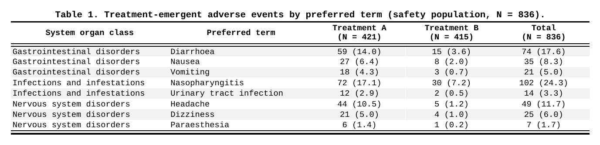

Notice how the three rules read like a caption: *band the odd rows, rule the
top, rule the bottom*. Three separate `compute_cols()` calls, each doing one
visually distinct thing — which is exactly how you want to be able to edit them
six months from now.

The same pair works whenever you need a boundary that is *absolute* rather than
value-driven — a lab table where the first measurement row should be separated
from the header no matter what the data says. Just remember that the marker is
one row: if a table is paginated (`isPaging`), `firstRow()` still fires only on
the true first row of the data, not on the first row of each page.

## Run boundaries: `firstOf()` and `lastOf()`

The core pair. `firstOf(col)` is `TRUE` at the first row of every run of equal
values in `col`; `lastOf(col)` mirrors it at the end of the run. Multiple
columns are allowed — `firstOf(A, B)` marks runs of the *pair*, which is a
handy way to say "this combination is new" without touching the data.

The most natural use is grouping structure without group columns. An AE
incidence table where every SOC block should open and close with a thin rule:

```{r}
spec <- create_table(ae_incidence) |>
  define_cols(SOC, label = "System organ class", colWidth = "30%") |>
  define_cols(PT,  label = "Preferred term",     colWidth = "26%") |>
  define_cols(INC, label = "Incidence<br>(%)", valueStyleRef = "ac", colWidth = "12%") |>
  define_cols(SEV, label = "Worst severity", valueStyleRef = "ac", colWidth = "16%") |>
  # a run of identical SOC starts here -> open the block
  compute_cols(firstOf(SOC), c_style(everything(), styleRef = "bt_th")) |>
  # ...and ends here -> close it
  compute_cols(lastOf(SOC),  c_style(everything(), styleRef = "bb_th"))
```

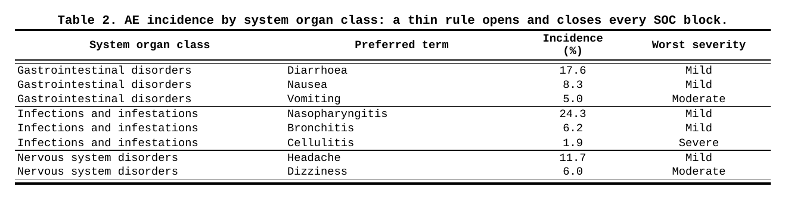

The repeated SOC text is still visually noisy here — two more lines fix it.
This is the classic dedupe idiom: negate `firstOf()` and blank what it protects.

```{r}
spec <- spec |>
  compute_cols(!firstOf(SOC), c_clear(SOC))
```

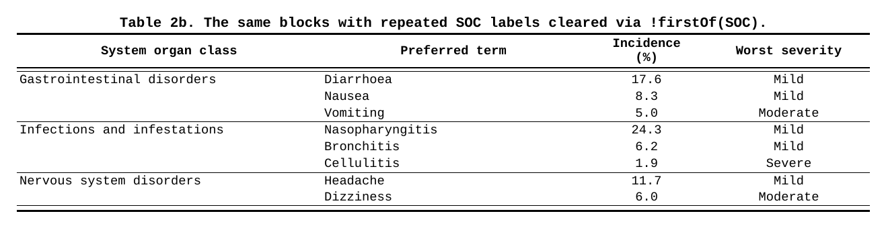

A demographic table shows the multi-column variant properly, where two different
notions of "is this row new?" live in two adjacent columns: age group changes
slowly, treatment changes twice per age group. Blanking each label against
*its own* run key gives the stepped reader's-eye layout:

```{r}
spec <- create_table(demog) |>
  define_cols(c(AGEGR1, TRTARM), label = c("Age group", "Treatment"), colWidth = "18%") |>
  define_cols(STAT, label = "Statistic", colWidth = "14%") |>
  define_cols(c(V1, V2), label = c("Visit 1<br>(Day 1)", "Visit 2<br>(Week 12)"),
              valueStyleRef = "ac", colWidth = "14%") |>
  # the age label lives only at the top of its own run
  compute_cols(!firstOf(AGEGR1), c_clear(AGEGR1)) |>
  # the treatment label re-appears at every new (age x treatment) combination
  compute_cols(!firstOf(AGEGR1, TRTARM), c_clear(TRTARM))
```

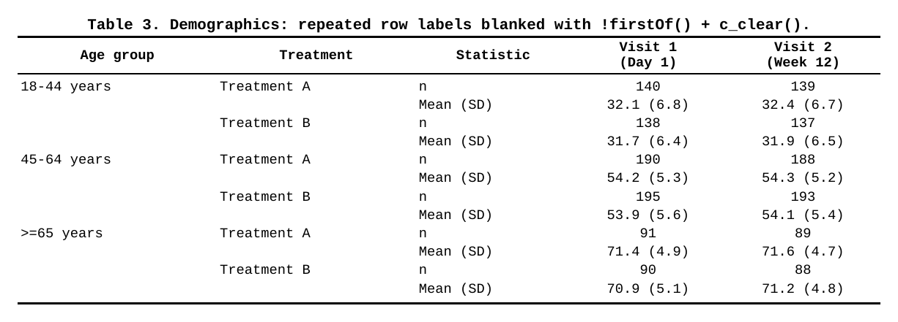

Why did `Treatment A` re-appear for the 45-64 group even though it is the same
arm? Because `firstOf(AGEGR1, TRTARM)` describes a *pair-run*, and the run
started over when the age group changed. One condition, no helper columns.

`lastOf()` earns its keep at the other end of the run — closing rules (above),
subtotal insertion (later), and anywhere you must act "after the group is done"
rather than "before it starts".

## Beat and number: `everyNth()` and `rowNumber()`

`everyNth(n)` is a tiny convenience: `TRUE` every `n` rows *counting from row 1*
(`n = 2` marks rows 1, 3, 5 ...). Two things to know. First, it counts **rows**,
not groups or records — with grouped data a "zebra" built from `everyNth(2)`
stripes the *table*, which is usually what you want, but does not respect block
edges; if you need banding *within* each block only, combine with the run
helpers (see the combination section). Second, when you want the *other* phase
of the stripe, there is no `everyNth(2, offset = 1)` — you write the arithmetic
yourself, and that is where `rowNumber()` comes in.

`rowNumber()` returns the row index (1-based) and composes in ordinary
expressions: comparisons, modulo, ranges.

```{r}
# even-row banding: the complement of everyNth(2)
compute_cols(rowNumber() %% 2 == 0, c_style(everything(), styleRef = "bg_gray"))

# "the first five rows are the top-5 AEs" -- a position rule
compute_cols(rowNumber() <= 5, c_style(PT, styleRef = "b"))

# "everything except the boundary rows" -- a range
compute_cols(rowNumber() > 1 & rowNumber() < 12, c_style(PARAM, styleRef = "ind1"))
```

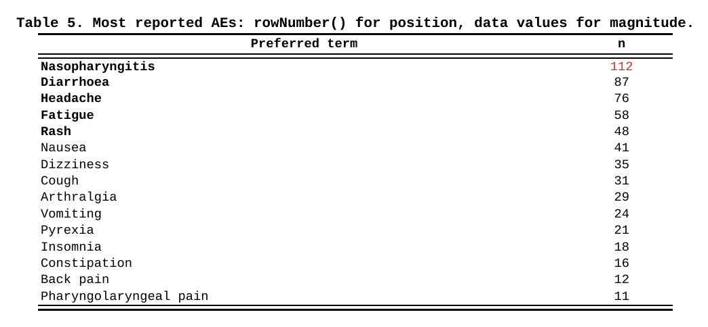

A position rule (`rowNumber() <= 5`) and a value rule (`N >= 100`) live
comfortably side by side — this table shows both: the first five rows are bold
because they are the top five, and `112` is red because it crosses a threshold.
Pre-sorting the frame is what makes the position rule meaningful; the helpers
then simply *read* the layout you arranged.

## Periodic runs: `firstOfBlock()`

`firstOfBlock(col, n = 1, offset = 0)` is `firstOf()` with a metronome: it
marks the first row of every `n`-th **run** of `col` — counting runs of
*equal* values, skipping the first block, and starting after `offset` blocks.
The mental model is "give me a beat that respects my blocks, not my rows".

A compact AE table where you want breathing room between pairs of SOC blocks
rather than between every one of them:

```{r}
spec <- create_table(ae_compact) |>
  define_cols(SOC, label = "System organ class", colWidth = "34%") |>
  define_cols(PT,  label = "Preferred term",     colWidth = "30%") |>
  define_cols(ALL, label = "Any AE<br>(n (%))", valueStyleRef = "ac", colWidth = "16%") |>
  # first row of blocks 3, 5, ... gets an inserted spacer row above it
  compute_cols(firstOfBlock(SOC, n = 2), c_addrow(pos = "above"))
```

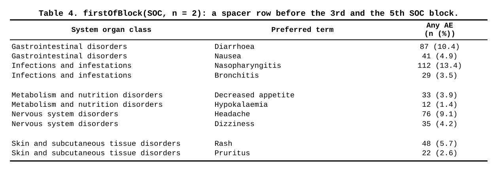

The counting rule is the part to pin down: with five SOC blocks,
`firstOfBlock(SOC, n = 2)` fires inside blocks **3 and 5**. The first block
never fires (nothing to separate it from), and every second block after that
does. `offset` rotates the beat: `offset = -1` moves it to the even blocks
(2 and 4 — use it when the *first* gap should already be visible), `offset = 1`
pushes it one block further (4 and 6). Think of it as "skip `offset` extra
blocks before the first marked one" and the three cases line up.

A typical honest use is a "block every other group" layout on long PK or lab
tables, where grouping rows into visual pairs of visits or periods is cheaper
than restructuring the data.

## Combinations: where the helpers earn their keep

Individually the helpers are one-liners. Together with the actions they cover
most of what a real table needs from conditional formatting, without a single
tag column. The five combinations below are the ones that show up in production
code over and over.

### 1. Footnote markers once per group: `firstOf()` + `c_glue()`

A PT reported at several grades should carry the footnote marker `a` exactly
once, at its first appearance — and the repeated PT rows usually blank their
label anyway. `firstOf(PT)` does the run work; `c_glue()` writes the marker:

```{r}
spec <- create_table(ae_by_grade) |>
  define_cols(c(SOC, PT, GRADE), label = c("SOC", "PT", "Grade"), colWidth = "18%") |>
  define_cols(N, label = "n", valueStyleRef = "ac", colWidth = "8%") |>
  compute_cols(firstOf(PT),  c_glue(PT, "after", text = "<sup>a</sup>")) |>
  compute_cols(!firstOf(PT), c_clear(PT)) |>
  add_footnote("<sup>a</sup>PTs reported in more than one grade.")
```

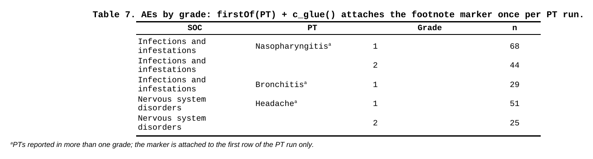

Inline markup (`<sup>`, `<i>`, ...) is parsed inside glue text, so the marker
renders as a real superscript. Note the pair `firstOf` / `!firstOf` on the same
column — the positive marks where to glue, the negated one clears the rest; two
honest halves of one layout rule.

### 2. Block headers from a hidden column: `firstOf()` + `c_addrow()`

The signature ksTFL idiom for sectioned tables. The analyst frame keeps `SOC`
as a plain column; you hide it and let its first-row boundary *become* a real
header row:

```{r}
spec <- create_table(ae_blocks) |>
  define_cols(SOC, label = "SOC", isVisible = FALSE) |>
  define_cols(PT,  label = "Preferred term", colWidth = "40%") |>
  define_cols(c(TRTA, TRTNT, TOTAL),
              label = c("Treatment A<br>(N = 421)", "Treatment B<br>(N = 415)",
                        "Total<br>(N = 836)"),
              valueStyleRef = "ac", colWidth = "13%") |>
  compute_cols(firstOf(SOC),
               c_addrow(pos = "above", value_from = SOC, styleRef = "grp_hdr"))
```

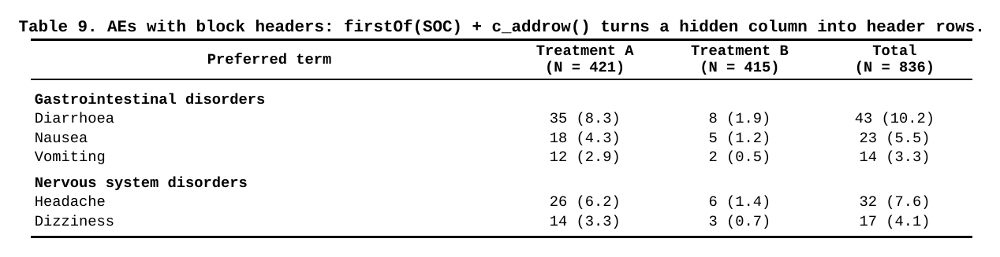

`value_from = SOC` copies the *raw* value into the synthetic row, and the
`styleRef` belongs to the added row itself — later blocks will not repaint it.
The price of admission: an added row is a single full-width cell, which is
great for headers and no good for subtotals with per-column numbers. For those,
see combination 3.

### 3. Subtotals assembled from the data: `lastOf()` + `c_glue()` + `c_style()`

Subtotal numbers belong to the data — the analyst computes them and appends a
total row per block (a run member with an empty PT). Then `lastOf(SOC)` marks
exactly those rows, because the subtotal extends its block's run, and glue
writes the label straight onto the still-present SOC value:

```{r}
spec <- create_table(ae_subtotals) |>
  define_cols(SOC, label = "System organ class", colWidth = "26%") |>
  define_cols(PT,  label = "Preferred term",     colWidth = "24%", missings = "") |>
  define_cols(c(TRTA, TRTNT, TOTAL),
              label = c("Treatment A<br>(N = 421)", "Treatment B<br>(N = 415)",
                        "Total<br>(N = 836)"),
              valueStyleRef = "ac", colWidth = "13%") |>
  # keep SOC text at block top; subtotal rows (empty PT) keep theirs untouched
  compute_cols(!firstOf(SOC) & !is.na(PT), c_clear(SOC)) |>
  # the subtotal IS the last row of the run: prepend the label, bold, close
  compute_cols(lastOf(SOC),
    c_glue(SOC, "before", text = "Subtotal: "),
    c_style(everything(), styleRef = f_combine("b", "bb")))
```

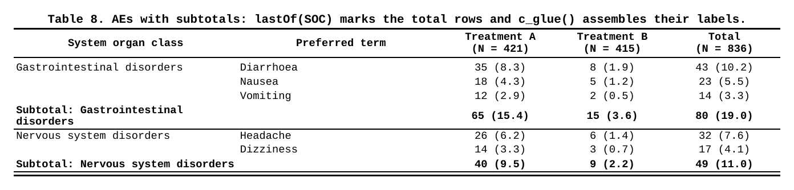

Two subtleties worth naming. The first `compute_cols()` deliberately *excludes*
the subtotal rows from clearing — `!is.na(PT)` — because the next block's
`c_glue()` decorates the text visible at action time, and on those rows the
visible SOC *is* the label ingredient. The row's own run membership still comes
from the raw data: conditions read original values, `c_clear()` only blanks the
painting. When the numbers must live in their columns (not in a synthetic
full-width row), the frame holds them and the helpers merely *point at* them.

### 4. Gaps between blocks, but never at the edge: `lastOf()` + `!lastRow()`

Plain `lastOf(SOC) + c_addrow(below)` adds a gap after every block *including
the final one* — a stray empty row before your footnotes. Compose the boundary
helpers to express "between, not after":

```{r}
spec <- spec |>
  compute_cols(lastOf(SOC) & !lastRow(), c_addrow(pos = "below")) |>
  compute_cols(firstOf(SOC), c_style(SOC, styleRef = "b"))
```

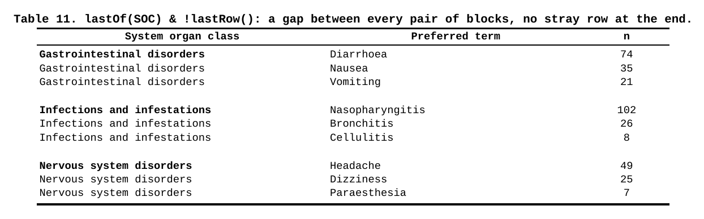

One run helper for the block edge, one absolute helper for the table edge,
intersected in plain R logic. There is no dedicated "gap between groups" verb —
the point of the design is that you do not need one.

### 5. Page breaks on block boundaries: `firstOf()` + `rowNumber()` + `c_pageBreak()`

Long safety exhibits often demand "one SOC per page". The break belongs on the
run start, minus the first row of the table — an absolute marker guarding the
value boundary:

```{r}
spec <- create_table(ae_socs) |>
  define_cols(SOC, label = "System organ class", colWidth = "34%") |>
  define_cols(PT,  label = "Preferred term",     colWidth = "30%") |>
  define_cols(N,   label = "n", valueStyleRef = "ac", colWidth = "10%") |>
  compute_cols(firstOf(SOC) & rowNumber() > 1, c_pageBreak())
```

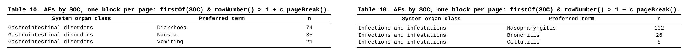

Without the `rowNumber() > 1` guard the renderer receives a page break on the
very first row and you get a blank lead page — the same trick works with
`firstOfBlock()` for "every second block on a new page". The header row
repeats on the new page by default, so each block arrives with its own context.

### All of them at once

A production safety summary: hidden `SECT` column generates bold section
headers (`firstOf` + `c_addrow`), every section but the last closes with a rule
(`lastOf` + `!lastRow`), and the Total arm is bolded by plain value logic
side-by-side with the run conditions:

```{r}
spec <- create_table(safety_summary) |>
  define_cols(SECT, label = "Parameter", isVisible = FALSE) |>
  define_cols(TRTARM, label = "Treatment", colWidth = "30%") |>
  define_cols(c(N, EVT), label = c("n", "Events<br>(n (%))"), valueStyleRef = "ac",
              colWidth = "20%") |>
  compute_cols(firstOf(SECT),
               c_addrow(pos = "above", value_from = SECT, styleRef = "grp_hdr")) |>
  compute_cols(lastOf(SECT) & !lastRow(), c_style(everything(), styleRef = "bb")) |>
  compute_cols(TRTARM == "Total", c_style(c(TRTARM, N, EVT), styleRef = "b"))
```

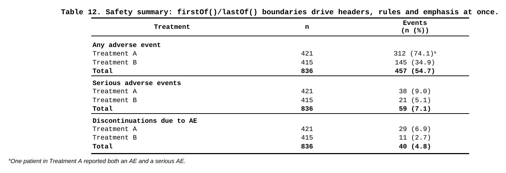

Three `compute_cols()` calls, one per visual feature — and the entire table is
described in terms a reviewer can verify against the spec document line by
line. No tag columns in the data, no post-processing pass, no template surgery.

## Honest edges

Things to know before your first surprise:

- **Run, not unique.** All of `firstOf` / `lastOf` / `firstOfBlock` count
  contiguous runs. Non-sorted data with re-appearing values will look
  "over-marked". Sort upstream — the renderer never will.
- **Raw data for conditions, display state for glue sources.** Conditions and
  `value_from` see the original values; `c_clear()` / `c_glue()` only change
  the painting — a later condition still matches a cleared cell's underlying
  value. But `c_glue(glue_col = ...)` copies the cell's text *as it stands at
  action time*: gluing a source that an earlier action cleared appends nothing.
- **One added row = one full-width cell.** Great for headers and spacers; put
  numeric subtotals in data rows instead (combination 3).
- **`value_from` lands in the first cell** of the synthetic row; there is no
  per-cell mapping across the added row.
- **Paginating tables**: `firstRow()` / `lastRow()` refer to absolute data
  positions, not per-page positions; `everyNth()` keeps counting across page
  breaks as well.
- **NA in a condition is an error**, not a skip — guard with `!is.na(x) &`
  when your frame can carry missing grouping values.

## Reference table

| Helper | Marks | Typical use |
|---|---|---|
| `firstRow()` | row 1 | header rule, table-level emphasis |
| `lastRow()` | final row | closing rule, grand total styling |
| `everyNth(n)` | rows 1, n+1, 2n+1, ... | zebra banding |
| `rowNumber()` | (returns indices) | ranges, modulo, top-N position rules |
| `firstOf(cols)` | start of each run | dedupe, block opening, headers, markers |
| `lastOf(cols)` | end of each run | closing rules, subtotal insertion |
| `firstOfBlock(col, n, offset)` | start of every n-th run | periodic block gaps |

They are condition-only — available nowhere else in the DSL — and all of them
are pure R against the frame you passed to `create_table()`. For action
semantics and ordering (`c_merge` before `c_clear` before `c_glue`, style
conflict resolution, addrow stacking), see
[Advanced StyleRows and Conditional Formatting](Advanced_StyleRows.html);
for the run-semantics gotcha in depth, see
[FAQ #13](FAQ_with_ksTFL.html).

```{r include=FALSE}
# Silence R CMD check for the (eval = FALSE) example code above.
invisible(sessionInfo())
```
