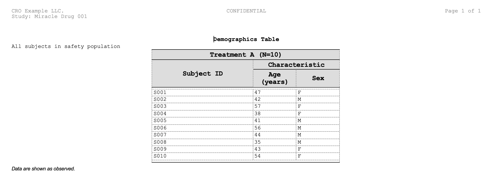

```{r setup, include=FALSE}
knitr::opts_chunk$set(
  comment = "", collapse = TRUE, eval = FALSE,
  dev = "png",
  dev.args = if (capabilities("cairo")) list(type = "cairo") else NULL
)
options(pkgdown.internet = FALSE)
```


## Introduction

**What is ksTFL?**

ksTFL is a lightweight R toolkit for building metadata specifications
for clinical Tables, Figures, and Text (TFLs). Unlike traditional table
formatters (flextable, huxtable, officer), ksTFL separates *metadata
generation* from *rendering*:

- You define the document structure, content, column formats, and styles
  in R.
- ksTFL generates a structured specification (JSON metadata + data
  files).
- The built-in C++ renderer turns it into a DOCX document with
  deterministic HarfBuzz-based pagination, via `write_doc()` or
  `replay_report()`.

The split pays off in four ways: every table follows the same style
templates, 50+ tables can be generated from one program with minimal
code, specifications are version-controllable and auditable, and the
renderer is separable from the R code that builds the spec.

Reach for ksTFL when you need:

- Regulatory clinical reporting (FDA, EMA submissions).
- Large-scale automated reporting (100+ tables from common data sources).
- Complex table structures: multi-level headers, spanning columns,
  conditional formatting.
- JSON metadata artifacts for downstream processing.

## How to use this guide

This is the foundation vignette and the starting point for new users: core
objects, main function flow, and the smallest complete pipeline.

Reading order after this vignette:

1. [Reporting Examples](Reporting_Examples_with_ksTFL.html) and
   [FAQ](FAQ_with_ksTFL.html) for the quickest practical follow-up.
2. [Styling Guide](Styling_Guide_with_ksTFL.html),
   [Column Width Management](Column_Width_Management.html), and
   [Advanced StyleRows](Advanced_StyleRows.html) for focused feature
   depth.
3. [Real Examples](Real_Examples_with_ksTFL.html) for fuller
   clinical-style outputs, then [Font Management](Font_Management.html)
   and [Rendering Pipeline](Rendering_Pipeline.html) when you need
   environment or renderer internals.

------------------------------------------------------------------------

## General workflow

### High-level pipeline

```
Data Frame / Image File
       ↓
create_table() / create_figure() / create_text()
       ↓
TFL_spec (customize with define_cols(), add_style(), add_span_header(),
         add_title(), compute_cols(), set_page_style(), set_document())
       ↓
create_report() (assemble specs, consolidate styles)
       ↓
TFL_report
       ↓
write_doc() ────────────────→ Styled .docx
save_report() → replay_report() ─┘  (two-step: inspect JSON first)
(C++ engine, deterministic HarfBuzz pagination)
```

### Anatomy of a TFL spec

Each `TFL_spec` contains:

| Component       | Purpose                                     | How to modify                        |
| --------------- | ------------------------------------------- | ------------------------------------ |
| **document**    | Metadata (docType, title, page settings)    | `set_document()`, `set_page_style()` |
| **columns**     | Column definitions, labels, formats, styles | `define_cols()`                      |
| **stubColumns** | Spanning headers above column groups        | `add_span_header()`                  |
| **headers**     | Page header text (left/center/right)        | `add_header()`                       |
| **titles**      | Main document titles                        | `add_title()`                        |
| **subtitles**   | Secondary titles                            | `add_subtitle()`                     |
| **bodyText**    | Narrative content                           | `add_body_text()`                    |
| **footnotes**   | Document footnotes                          | `add_footnote()`                     |
| **footers**     | Page footer text                            | `add_footer()`                       |
| **styles**      | Named styles defined with `add_style()`     | `add_style()`                        |

------------------------------------------------------------------------

## Quick 5-minute example

```{r quick_pipeline, eval = FALSE}
library(ksTFL)

# 1. Create a table spec from data
spec <- create_table(mtcars, cols = c(mpg, cyl, hp))

# 2. Define a style and apply it
spec <- add_style(spec, id = "header_bold",
  s_font(bold = TRUE, font_size = "12pt"))

# 3. Customize columns
spec <- define_cols(spec, c(mpg, cyl, hp),
  label = c("MPG", "Cylinders", "HP"),
  type = c("numeric", "numeric", "numeric"),
  format = c("%.1f", "%.0f", "%.0f"),
  labelStyleRef = "header_bold") |>
# 4. Add titles and footnotes
add_title("Motor Trend Car Road Tests") |>
add_footnote("Data from mtcars (1974).")

# 5. Inspect the spec
print(spec)

# 6. Render to DOCX
report <- create_report(spec)
write_doc(report, name = "my_table", outDir = "./output", metaPath = tempdir())
```

------------------------------------------------------------------------

## Step 1: Create a TFL_spec

Choose the document type and initialize:

### Table spec (from data frame)

```{r create_table_spec, eval = FALSE}
# Simple: all columns
spec_tbl <- create_table(mtcars)

# Select specific columns with tidyselect
spec_tbl <- create_table(mtcars, cols = c(mpg, cyl, hp, wt))

```

**What happens**:

- Data is shadow-copied into the spec's internal environment (not
modifiable)

- Columns are auto-analyzed (type detection, width calculation)

- A `TFL_spec` object is returned ready for customization

**Understanding the `cols` parameter**:

The `cols` argument controls which columns appear in the rendered
document and in what order — it does **not** filter or mutate the input
data frame. Think of it as a *presentation lens*: the full dataset is
still stored inside the spec (captured as a snapshot at `create_table()`
time — later edits to the source data frame do not reach the spec), but
only the columns listed in `cols` are emitted to the final report.

This distinction matters when you use `compute_cols()` later in the
pipeline. Because the original data frame is preserved intact,
`compute_cols()` conditions can reference **any** column in the data —
including columns that are **not** listed in `cols` and will never
appear in the output. For example, you might exclude a `flag` column
from the report but still use it to drive conditional styling:

```{r cols_concept, eval = FALSE}
demog <- data.frame(
  age = c(45, 62, 38), sex = c("M", "F", "F"),
  trt = c("A", "A", "B"), flag = c("Y", "N", "Y"),
  stringsAsFactors = FALSE)

# Only age, sex, trt go to the document; flag stays out of cols
spec <- create_table(demog, cols = c(age, sex, trt)) |>
  add_style(id = "highlight", s_font(bold = TRUE))

# But flag is still available for conditional logic: the first argument of
# compute_cols() is the condition, followed by the actions
spec <- compute_cols(spec, flag == "Y",
  c_style(c(age, sex), styleRef = "highlight"))
```

The order in which columns are passed to `cols` also determines their
left-to-right order in the rendered table, so `cols` doubles as a
convenient column-reordering mechanism — no need to rearrange the
underlying data frame.

One caveat: the lens applies to CONDITIONS only. `define_cols()` and the
column arguments of the `c_*()` actions can address only columns included
in `cols` — an excluded column can be tested, never styled. To drive a
helper field into actions, include it in `cols` and hide it with
`isVisible = FALSE` instead of dropping it.

### Figure spec (from image file)

```{r create_figure_spec, eval = FALSE}
# From a file path — PNG, JPEG/JPG, or SVG (the renderer's supported formats)
png_plot <- file.path(tempdir(), "plot.png")
png(png_plot, width = 600, height = 400)
plot(mtcars$wt, mtcars$mpg); dev.off()
spec_fig <- create_figure(png_plot)

# From a ggplot2 object — rendered automatically to a temporary image file.
# The DEFAULT device is "cairo": a paths-only SVG (text converted to vector
# outlines), which is the MS Word-safe vector format.
library(ggplot2)
p <- ggplot(mtcars, aes(x = wt, y = mpg)) + geom_point()
spec_fig <- create_figure(p)             # cairo SVG (default)
spec_fig <- create_figure(p, dpi = 150L) # dpi applies to raster devices only

# Device options:
#   figureDevice = "cairo" (default) -> Word-safe paths-only SVG (needs Cairo)
#   figureDevice = "svg"             -> svglite text-SVG: renders correctly in
#                                        LibreOffice but is CROPPED/RESKINNED
#                                        by MS Word (font substitution,
#                                        text-anchor, px-scaling bugs) —
#                                        use only when Word is not the target
#   figureDevice = "png"/"jpeg"      -> raster (300 dpi by default)
# If Cairo/svglite are missing, ksTFL falls back cairo -> svg -> png with a
# one-time warning, so figure production never breaks on a dev machine.
#
# Two sizing knobs: session options figureWidth/figureHeight set the EXPORT
# size for ggplot objects at create_figure() time; set_document(figureWidth =
# ..., figureHeight = ...) sizes only the box the image is embedded into.
# tfl_set_options(figureWidth = "8in", figureHeight = "5in", figureDevice = "png")
#
# The default scale mode "fixed" stretches whatever you embed into the
# width/height box. To keep a file figure's own aspect ratio, use
# set_document(figureScaleMode = "fitKeepAR") — it reads the intrinsic AR of
# the PNG/JPEG/SVG and fits it into the body area.
```

**What happens**:

- If a **file path** is given: it is validated (must exist and be
readable); the file is used as-is

- If a **ggplot2 object** is given: rendered to a `tempdir()` file using
the package defaults (`figureWidth`, `figureHeight`, `figureDevice`). The
default `figureDevice = "cairo"` goes through `Cairo::CairoSVG()` (paths-only,
MS Word-safe vector); raster and `"svg"` devices go through
`ggplot2::ggsave()`. The resulting path is stored in the spec.

- The `dpi` parameter applies to raster devices (`png`/`jpeg`); it is
ignored for the vector `cairo`/`svg` output. width/height/device are
configured through package options.

- The image file is copied to `metaPath` when the report is saved

### Text spec (narrative content)

```{r create_text_spec, eval = FALSE}
spec_txt <- create_text()

# Add narrative content
spec_txt <- add_body_text(spec_txt, "This analysis includes all subjects in the safety population.")
```

**What happens**: - Empty spec with no data - Ready for narrative
content via `add_body_text()`

------------------------------------------------------------------------

## Step 2: Customize columns (define_cols)

After creating a table spec, customize columns with `define_cols()`:

### Single column

```{r define_single_column, eval = FALSE}
spec <- create_table(mtcars)

spec <- define_cols(spec, mpg,
  label = "Miles per Gallon",
  type = "numeric",
  format = "%.1f",
  colWidth = "20%")
```

### Batch update (multiple columns with single values)

```{r define_batch_single, eval = FALSE}
# (continuing from the previous chunk: spec = create_table(mtcars))

# Apply same label format to all columns
spec <- define_cols(spec, c(mpg, cyl, hp),
  label = c("MPG", "Cylinders", "HP"),
  type = "numeric",        # Recycled to all 3
  format = "%.0f")         # Recycled to all 3
```

### Per-column customization

```{r define_batch_mapped, eval = FALSE}
# Different format for each column
spec <- define_cols(spec, c(mpg, cyl, hp),
  label = c("MPG", "Cylinders", "HP"),
  type = c("numeric", "numeric", "numeric"),
  format = c("%.1f", "%.0f", "%.0f"))
```

**Key parameters**:

- `label`: Column header text

- `type`: "numeric" or "string" (auto-detected if omitted)

- `format`: Format string (e.g., "%.2f", "0.00")

- `colWidth`: Column width as a string with unit `"%"`, `"in"`, or
  `"cm"` (e.g. `"20%"`, `"2cm"`). When set, the column is locked to that
  width and the other unlocked columns auto-recalculate to sum to 100%.
  Locked widths must leave at least 0.5% for the last unlocked column
  (total locked <= 99.5%). Disable auto-recalculation with
  `tfl_set_options(autoColWidth = FALSE)`.
- `isVisible`: `TRUE` (default) or `FALSE`. A hidden column renders at
  width "0.0cm", is excluded from width recalculation, and rejects any
  `colWidth` set in the same call — set labels/widths first, hide last.

- `isID`: TRUE if column repeats on page breaks

- `dedupe`: TRUE to clear consecutive repeating values in a column

- `isColBreak`: TRUE on a column that needs to be moved on the next
page (break long tables)

- `labelStyleRef`: Style(s) to apply to column header

- `valueStyleRef`: Style(s) to apply to cell values

**Hiding Columns**:

```{r hiding_columns, eval = FALSE}
dat <- data.frame(group_id = 1:3, value = c(1.5, 2.5, 3.5))
spec <- create_table(dat) |>
  define_cols(group_id, isVisible = FALSE)
# Result: group_id is hidden, other columns recalculated to fill 100%
```

See [Reporting Examples](Reporting_Examples_with_ksTFL.html) for detailed
column customization patterns.

------------------------------------------------------------------------

## Step 3: Define styles (add_style)

Create reusable named styles with `add_style()`:

```{r define_styles, eval = FALSE}
spec <- create_table(mtcars)

# Header style: bold, 12pt, centered, gray background
spec <- add_style(spec, id = "table_header",
  s_font(font_name = "Arial", font_size = "12pt", bold = TRUE),
  s_paragraph(alignment = "center"),
  s_table_style(background_color = "#E0E0E0"))

# Numeric style: right-aligned
spec <- add_style(spec, id = "numeric_right",
  s_paragraph(alignment = "right"))

# Apply to columns
spec <- define_cols(spec, c(mpg, hp),
  labelStyleRef = "table_header",
  valueStyleRef = "numeric_right")
```

**Best practice**: Define styles once, reference by id (name) throughout
your spec. If style needs to be used across many tables define it thru
`tfl_set_options()` to make it available session-wide.

For comprehensive styling details see [Styling
Guide](Styling_Guide_with_ksTFL.html).

------------------------------------------------------------------------

## Step 4: Add spanning headers (span headers)

Create multi-level headers with `add_span_header()` using tidyselect
expressions:

```{r add_stubs, eval = FALSE}
spec <- create_table(mtcars)
spec <- define_cols(spec, c(mpg, cyl, hp, wt),
  label = c("MPG", "Cyl", "HP", "Weight"))

# Band 1 (directly above the column-label row): finer grouping — these two
# share one row because their column sets do not overlap
spec <- add_span_header(spec, cols = c(mpg, cyl, hp),
  label = "Engine",
  stubOrder = 1) |>
add_span_header(cols = wt,
  label = "Weight",
  stubOrder = 1) |>
# Band 2 (higher on the page): full-width banner above both
add_span_header(cols = c(mpg, cyl, hp, wt),
  label = "Motor Vehicle Specs",
  stubOrder = 2)
```

**Tidyselect support**: `add_span_header()` accepts all tidyselect
expressions:

```{r add_stubs_tidyselect, eval = FALSE}
# Fresh spec (stub sets must not overlap within one stubOrder)
spec_ts <- create_table(mtcars)

# Using column ranges and helpers
spec_ts <- add_span_header(spec_ts, cols = mpg:hp, label = "Engine block", stubOrder = 0) |>
  add_span_header(cols = wt:qsec, label = "Chassis", stubOrder = 0)
```

**Key concepts**:

- `cols`: Column names to span. Names resolve against the full data
frame, then intersect with the spec's columns, so a column excluded via
`create_table(cols = ...)` silently selects nothing.

Accepts:

- **Unquoted names**: `c(mpg, cyl, hp)`

- **Quoted names**: `c("mpg", "cyl", "hp")`

- **Ranges**: `mpg:hp`

- **Helpers**: `starts_with("c")`, `contains("w")`, `matches("^m")`

- **Negation**: `-mpg` (all columns except mpg)

- `label`: Spanning header text

- `stubOrder`: Vertical stacking order — HIGHER numbers render HIGHER
on the page. `stubOrder = 1` is the band directly above the column-label row,
`stubOrder = 2` sits above it (0 and negatives are allowed too — every band
still renders above the column labels; they only sort against each other by
value). Auto-generated when `NULL`: each later call takes the next number and
stacks above the earlier ones — which builds a staircase, one band per call.
Prefer an explicit `stubOrder` on every call: sibling bands that belong on the
same row share a number (their column sets must not overlap).

- `labelStyleRef`: style id defined via `add_style()`, or style atoms
  combined with `f_combine()` (see the Styling Guide), for the band label.

**Rules**:

- Stubs at the **same** `stubOrder` cannot share columns (prevents
ambiguous headers)

- Stubs at **different** `stubOrder` values can overlap freely (enables
hierarchical structure)

- Multiple stubs at the same order are allowed as long as their column
sets don't overlap

- Use `add_style()` to style stub labels or use embedded atomic styles

See [Styling Guide](Styling_Guide_with_ksTFL.html) for styling stubs.

------------------------------------------------------------------------

## Step 5: Add titles, footnotes, headers, footers

Add document content layers:

```{r add_content, eval = FALSE}
spec <- create_table(mtcars)

# Titles and subtitles
spec <- add_title(spec, "Motor Trend Car Road Tests")
spec <- add_subtitle(spec, "Analysis of 1974 road-test data")

# Footnotes (document-level notes)
spec <- add_footnote(spec, "Values are from 1974 Motor Trend magazine.")

# Page headers (left/center/right) — three separate string arguments
spec <- add_header(spec, "Study ABC", "CONFIDENTIAL", "Page {PAGE}")

# Page footers (left/center/right) — three separate string arguments
spec <- add_footer(spec, "Company", "Locked DB", "2025")

# Body text (narrative)
spec <- add_body_text(spec, "This analysis includes all subjects in the safety population.")
```

**Notes**:

- `add_header()` and `add_footer()` take up to 3 separate string
arguments: left, center, right

- Placeholders like `{PAGE}` and `{NUMPAGES}` are filled in by the
renderer

- Multiple `add_header()` calls append additional header rows; use the
`level` parameter to replace a specific row

- Multiple `add_footnote()` calls stack in order

- `add_title()` and `add_subtitle()` accept an optional `toclevel`
  parameter (integer, `1` to `9`). When set, the title is included in the
  Table of Contents generated by `write_doc(toc = TRUE)`. The TOC is a
  Word field: entries are written at render, but Word populates the list
  only after the field updates (F9, or print preview). Each
  `add_title()`/`add_subtitle()` CALL contributes one entry — a
  multi-line vector title stays a single entry.

------------------------------------------------------------------------

## Step 5b: Page layout and templates

### Page size, orientation, and margins

Use `set_page_style()` with `p_page()` and `p_margins()` to control the
physical page layout:

```{r page_layout, eval = FALSE}
spec <- create_table(mtcars) |>
  set_page_style(
    page = p_page(
      size        = "A4",        # "A4", "A3", "Letter", "Legal", "Executive"
      orientation = "landscape",  # "portrait" or "landscape"
      margins     = p_margins(
        top    = "1in",
        bottom = "1in",
        left   = "0.75in",
        right  = "0.75in",
        header = "0.5in",
        footer = "0.5in"
      )
    )
  )
```

**`p_page()` parameters**:

- `size`: Page size — `"A4"` (default), `"A3"`, `"Letter"`, `"Legal"`, or
  `"Executive"`.
- `orientation`: `"portrait"` or `"landscape"`. When omitted, the
  TEMPLATE's orientation applies — every bundled template except
  `Classic_portrait` is landscape, so a bare `p_page(size = "A4")` still
  comes out landscape.
- `margins`: a margins object from `p_margins()`. The margin fields accept
  dimension strings (`"1in"`, `"2.54cm"`, `"72pt"`, `"25.4mm"`).

**`p_margins()` parameters** (all accept dimension strings like `"1in"`,
`"2.54cm"`, `"72pt"`, `"25.4mm"`):

- `top`, `bottom`, `left`, `right`: Page margins

- `header`, `footer`: Distance from page edge to header/footer content

### Document templates

Templates control the visual appearance (colours, fonts, borders) of the
rendered DOCX:

```{r templates, eval = FALSE}
# List all bundled templates
tfl_list_templates()

# Apply a bundled template
spec <- create_table(mtcars) |>
  set_page_style(docTemplate = "Navy_Pro")

# Or apply via set_document()
spec <- create_table(mtcars) |>
  set_document(hasData = TRUE, docTemplate = "Carbon_Dark")

# Use a custom external template (JSON file). An ABSOLUTE path always works. A
# RELATIVE path is checked against your working directory at authoring time and
# stored verbatim; at render time it is resolved against the render working
# directory first and, when not found there, against the directory of the saved
# spec JSON (and its parent) — so replaying a saved report from another folder
# still finds a template that sits next to the saved spec. Only when every
# candidate misses does the package warn and fall back to the "Default"
# template. For portable scripts, keep the template next to the saved spec
# (the meta folder), where replay can always resolve it, or use a bundled
# name. At authoring time the relative path must already exist in the
# working directory — set_page_style() errors if it does not. (Any template JSON works, including a copy of a bundled
# one, which is what this example does.)
my_tpl <- file.path(tempdir(), "my_custom_template.json")
file.copy(system.file("templates", "Navy_Pro.json", package = "ksTFL"), my_tpl)
spec <- create_table(mtcars) |>
  set_page_style(docTemplate = my_tpl)
```

Bundled templates: `Default`, `Navy_Pro`, `Carbon_Dark`, `Classic_portrait`,
`Classic_landscape_times`, `Listings`, `Regulatory_Arial` (confirm any time
with `tfl_list_templates()`).

Use `docTemplate` on the spec when different sections of one report should keep
different looks. Use `write_doc(..., overrideTemplate = ...)` or
`replay_report(..., overrideTemplate = ...)` when you want one global template
to override every spec in the rendered document.

Use `run_styles_editor()` to interactively create and edit template JSON
files.

------------------------------------------------------------------------

## Step 6: Apply conditional row actions (compute_cols)

Beyond global column styling, apply **conditional actions** to specific
rows that match a condition:

```{r compute_cols_basic, eval = FALSE}
spec <- create_table(mtcars)

# Define a style for first group occurrences
spec <- add_style(spec, id = "group_header", s_font(bold = TRUE, color = "#0000FF"))

# Apply style conditionally: highlight first occurrence of each cyl group
spec <- compute_cols(spec, firstOf(cyl), 
  c_style(c(mpg, hp), styleRef = "group_header"))

# Add a separator row above first group
spec <- compute_cols(spec, firstOf(cyl), 
  c_addrow(pos = "above"))
```

**Common use cases**:

- Highlight group headers: style the first/last row of each group run
- Add separators: insert empty rows between groups
- Merge columns: create group headers by merging adjacent columns
- Conditional formatting: style rows meeting a threshold (e.g. `value > 100`)

**Key action functions** (used inside `compute_cols()`):

| Function                                            | Purpose                                           | Example                                       |
| --------------------------------------------------- | ------------------------------------------------- | --------------------------------------------- |
| `c_style(cols, styleRef)`                           | Apply style to columns in matching rows           | `c_style(c(mpg, hp), styleRef = "group_header")` |
| `c_merge(cols, styleRef = NULL)`                    | Merge ADJACENT columns into one cell              | `c_merge(c(col1, col2), styleRef = "header")` |
| `c_addrow(pos, value_from = NULL, styleRef = NULL)` | Insert row above/below                            | `c_addrow(pos = "above")` for empty separator |
| `c_glue(cols, position, glue_col/text, separator)`  | Append/prepend text to VISIBLE cells              | `c_glue(PARAM, "after", glue_col = VISIT)`    |
| `c_clear(cols)`                                     | Blank the rendered text of visible cells          | `c_clear(label)` in total rows                |
| `c_pageBreak()`                                     | Insert a page break at the matching row (no args) | `c_pageBreak()`                               |

**Condition syntax**:

```{r compute_cols_conditions, eval = FALSE}
# Direct column comparison (mtcars has no 'group'/'zebra' styles —
# define every styleRef before referencing it; create_report() aborts
# on undefined references)
spec <- add_style(spec, id = "high_power", s_font(bold = TRUE))
compute_cols(spec, cyl > 6, c_style(mpg, styleRef = "high_power"))

# String matching (in a clinical listing, e.g.: Parameter == "Pulse")
compute_cols(spec, am == 1, c_style(mpg, styleRef = "group_header"))

# Helper functions available INSIDE compute_cols() conditions:
#   firstOf(col1, col2, ...)  — TRUE at the first row of each RUN of equal
#                               values (contiguous groups — sort the data first)
#   lastOf(col1, col2, ...)   — TRUE at the last row of each RUN
#   firstRow()                — TRUE only for the very first data row
#   lastRow()                 — TRUE only for the very last data row
#   everyNth(n)               — TRUE every n-th row (1, n+1, 2n+1, ...)
#   rowNumber()               — 1-based row index
#   firstOfBlock(col, n, offset) — first row of every n-th block
# Note: these helpers are NOT standalone functions — they only work inside
# the condition argument of compute_cols().

compute_cols(spec, firstOf(cyl), c_style(c(mpg, hp), styleRef = "group_header"))
compute_cols(spec, lastOf(cyl), c_addrow(pos = "below"))

# A scalar condition is allowed: compute_cols(spec, TRUE, ...) acts on all rows
compute_cols(spec, TRUE, c_style(disp, styleRef = "group_header"))

# Combine conditions with base logical operators
compute_cols(spec, cyl == 8 & hp > 100, c_style(mpg, styleRef = "high_power"))

# Aggregates are allowed as scalars: the condition below compares every row
# against the whole-column mean (mean(cyl) > 4 evaluates once)
compute_cols(spec, hp > mean(hp), c_style(hp, styleRef = "high_power"))
```

**Key concepts**:

- Conditions are evaluated ONCE, when `create_report()` finalizes the
  spec — call `compute_cols()` before assembling the report (see next
  step)
- Conditions always read RAW column values — glued, cleared, or deduped
  display text never changes which rows match
- A condition must be TRUE/FALSE per row (or one scalar); any NA aborts
  `create_report()`, so guard with `!is.na(x)`
- Multiple `compute_cols()` calls accumulate on the same spec; actions
  combine in arrival order, later actions win on conflicting style
  properties
- `value_from = NULL` in `c_addrow()` creates an empty separator row

For detailed examples see [Reporting Examples: Conditional Row
Actions](Reporting_Examples_with_ksTFL.html#conditional-row-actions-with-compute_cols).

------------------------------------------------------------------------

## Step 7: Combine specs into a report

Assemble multiple specs with `create_report()`:

```{r create_report, eval = FALSE}
# Create multiple specs
spec_table <- create_table(mtcars)
spec_table <- add_title(spec_table, "Table 1: Motor Trend Road Tests")

spec_text <- create_text()
spec_text <- add_body_text(spec_text, "Analysis performed in R.")

# Combine into single report
report <- create_report(spec_table, spec_text)

# Inspect combined report
print(report)
```

**What `create_report()` does**:

1. Flattens inputs — including plain `list` arguments (see below)
2. Validates structure
3. Consolidates combined styles (if any used `f_combine()`)
4. Assigns sequential `docOrder` (1, 2, 3, ...)
5. Creates `dataRef` names for new specs
6. Finalizes `compute_cols()` conditions and validates all style
   references — an undefined `styleRef` id aborts here

**Result**: a named list of specs (class `TFL_report`), in input order.

### Passing a named list of specs

You can also build specs into a named list and pass the whole list at
once — useful when the set of outputs is assembled dynamically:

```{r create_report_list, eval = FALSE}
specs <- list(
  t_dm   = spec_table,
  t_text = spec_text
)

report <- create_report(specs)
# names(report): "t_dm_<hash>", "t_text_<hash>"
```

List and variadic arguments may be freely mixed:

```{r create_report_mixed, eval = FALSE}
extra <- create_text() |> add_body_text("Appendix.")
report <- create_report(extra, specs)
```

Report titles/subtitles marked with `toclevel` feed a Table of Contents
page — see Step 8 (`write_doc(toc = TRUE)`).

> **Order matters**: `compute_cols()` added AFTER `create_report()` has
> no effect — the report snapshots and finalizes the specs it was given.

------------------------------------------------------------------------

## Step 8: Save and Render

### Option A: One step with `write_doc()` (recommended)

`write_doc()` combines save + render into a single call:

```{r write_doc, eval = FALSE}
report <- create_report(spec_table, spec_text)

# Returns the full path to the generated .docx (invisibly)
doc_path <- write_doc(report,
  name     = "demographics",          # Output file name (no extension)
  outDir   = "./output",              # Where the final .docx is written
  metaPath = tempdir())               # Where JSON metadata is written (temp is fine)
```

**Additional parameters**:

- `toc`: if `TRUE`, prepends a Word TOC field page. Entries come only
  from titles/subtitles carrying `toclevel`; with none, the field updates
  to an empty list. Default follows the `insertTOC` option.
- `tocTitle`: heading above the TOC field (default `"Table of Contents"`).
- `prettify`: if `TRUE`, writes human-readable JSON metadata (useful for
  debugging). The DOCX bytes are identical either way.
- `verbose`: if `TRUE`, prints renderer progress messages to the R
  console.

`name` is passed without extension — `write_doc()` appends `.docx`, so
`name = "demographics.docx"` would produce `demographics.docx.docx`.

This is the recommended approach for production use. Set session
defaults once:

```{r write_doc_with_options, eval = FALSE}
dir.create("./output", showWarnings = FALSE)
dir.create("./meta", showWarnings = FALSE)
tfl_set_options(
  output_directory = "./output",
  meta_directory   = "./meta"
)

# Then write_doc() uses those defaults automatically
write_doc(report, name = "demographics")
```

### Option B: Two steps with `save_report()` + `replay_report()`

Use this when you need to inspect or version-control the JSON metadata
separately:

```{r save_report, eval = FALSE}
report <- create_report(spec_table, spec_text)

# Step 1: Serialize to JSON + data files
result <- save_report(report,
  docFileName = "my_report.docx",
  outDir      = "./output",
  metaPath    = tempdir(),
  prettify    = TRUE)              # prettify = TRUE for readable JSON (debugging)

# Step 2: Re-render the DOCX from the saved JSON metadata
replay_report(
  spec_json   = result$spec_file,
  meta_dir    = result$metaPath,
  output_path = file.path("./output", "my_report.docx"))
```

**`save_report()` output files**:

- `{metaPath}/{spec_hash}.json` — main specification (consumed by the
  renderer)
- `{metaPath}/{dataRef}.json` — table data files (one per table spec)
- Figure files copied into `metaPath`, original extension preserved

------------------------------------------------------------------------

## Step 9: JSON metadata — what it is and why you might need it

### What is the metadata folder?

Every time `write_doc()` (or `save_report()`) runs, it writes
intermediate files to `metaPath`:

-   **`{hash}.json`** — The main spec file: document structure, column
    definitions, styles, titles, footnotes, headers/footers. This is
    what the C++ renderer reads.
-   **`{dataRef}.json`** — One data file per table spec, containing the
    actual row data.
-   **Figure files** — Copied from their original paths into `metaPath`.
-   **`_index.json`** — An index of all spec files written to this
    folder (auto-maintained).

For most workflows, `metaPath = tempdir()` is fine — you only care about
the final `.docx`. But there are real reasons to use a persistent
`metaPath`.

### Why use a persistent metaPath?

**Reproducibility / audit trail**: In regulated environments (FDA, EMA
submissions), you may need to prove that a specific DOCX was generated
from a specific dataset at a specific time. The spec JSON + data JSON
together form a complete, reproducible snapshot.

**Re-rendering from stored metadata**: Once the JSON files exist,
`replay_report()` re-renders the DOCX straight from them — no in-memory
specs or data frames needed (it is still an R call, but it needs nothing
from the original session). Useful for regenerating a document after a
template change, rendering on a different machine or in a CI pipeline, or
reproducing an output months later.

**Version management**: each save writes a hash-named spec JSON;
identical content reuses its hash and updates the existing entry instead
of adding a version. The folder never prunes itself:
`replay_report("name.docx")` always renders the newest indexed version,
and `clean_reports(keep_versions = 1)` is the way to trim history.

### Managing metadata files

```{r metadata_management, eval = FALSE}
meta_dir <- "./meta"
# (report + ./meta set up by the previous chunks; write_doc already saved
#  its spec there — or call save_report(report, "demo.docx", metaPath = meta_dir))

# List all spec JSONs in the meta folder
df <- list_reports(meta_dir)
print(df[df$is_latest, c("doc_file", "datetime", "spec_file")])

# Re-render a DOCX from stored JSON (no R objects needed)
replay_report("demographics.docx", meta_dir = meta_dir)

# Or replay a specific version by its spec JSON file name
some_spec <- df$spec_file[1]
replay_report(some_spec, meta_dir = meta_dir,
              output_path = "./output/demographics_v2.docx")

# Clean up obsolete spec files (keeps latest version per document)
clean_reports(meta_dir, dry_run = TRUE)   # Preview what would be deleted
clean_reports(meta_dir, dry_run = FALSE)  # Actually delete
```

**`list_reports()`** returns a data frame with columns: `doc_file`,
`datetime`, `is_latest`, `n_specs`, `spec_file`, `data_refs`.

**`replay_report()`** re-renders from JSON — no R spec objects, no data
frames required. Pass either the target `.docx` name (re-renders the
latest version) or the exact spec hash filename.

**`clean_reports()`** removes obsolete JSON files. By default keeps 1
version per document (`keep_versions = 1`). Always run with
`dry_run = TRUE` first.

### Recommended production setup

```{r production_setup, eval = FALSE}
# Set persistent meta directory once per session
tfl_set_options(
  output_directory = "./output",
  meta_directory   = "./meta"   # Persistent — survives session restarts
)

# All write_doc() calls now use these directories automatically
report1 <- create_report(create_table(mtcars) |> add_title("Table 1"))
report2 <- create_report(create_table(iris)    |> add_title("Table 2"))
write_doc(report1, name = "tbl_demographics")
write_doc(report2, name = "tbl_labs")

# Later: re-render without R if needed
replay_report("tbl_demographics.docx", meta_dir = "./meta")
```

------------------------------------------------------------------------

## Understanding auto-generated values

### Column widths (auto-calculation)

When you create a table, widths are auto-calculated based on data
characteristics:

```{r auto_widths_example, eval = FALSE}
# Auto-calculated widths depend on content. For mtcars:
# mpg ~6.3%, cyl ~5.1%, ... (inspect with print(spec))
spec <- create_table(mtcars)

# Lock mpg to 15%; the other unlocked columns recalculate
# proportionally to fill the remaining 85%
spec <- define_cols(spec, mpg, colWidth = "15%")
```

See [Reporting Examples](Reporting_Examples_with_ksTFL.html) for detailed
width customization.

### Data references (dataRef)

Each table spec gets a `dataRef` name for its data file:

```{r dataref_example, eval = FALSE}
# dataRef keys look like "0001_abc123def456" (docOrder + hash):
report <- create_report(
  create_table(mtcars) |> add_title("Table 1"),
  create_table(iris)   |> add_title("Table 2")
)
names(report)  # "0001_<hash>", "0002_<hash>"

# Manual control is not needed — write_doc() handles it
write_doc(report, name = "my_report", outDir = "./output", metaPath = "./meta")
```

------------------------------------------------------------------------

## Session-wide defaults with `tfl_set_options()`

Set defaults once, inherited by all new specs. Defaults are snapshotted
when each spec is created — set options BEFORE building specs:

```{r session_options, eval = FALSE}
# Set session defaults
tfl_set_options(
  add_header("Study ABC", "Locked Database", "CONFIDENTIAL"),
  add_footer("Company Name", "Page {PAGE}", "2025"),
  add_body_text("Analysis performed in R with ksTFL."))

# All new specs created afterward inherit these settings
spec1 <- create_table(mtcars)  # Automatically gets headers/footers/body text
spec2 <- create_table(iris)    # Also inherits defaults

# Check current options
tfl_get_options()

# Reset to package defaults
tfl_reset_options()
```

------------------------------------------------------------------------

## Complete example: From data to document

```{r complete_example, eval = FALSE}
library(ksTFL)

# --- Setup ---
data <- data.frame(
  subject = sprintf("S%03d", 1:10),
  age = round(rnorm(10, 45, 10)),
  sex = sample(c("M", "F"), 10, TRUE)
)

# --- Create & customize ---
spec <- create_table(data, cols = c(subject, age, sex))

spec <- add_style(spec, id = "header",
                  s_font(bold = TRUE, font_size = "11pt"),
                  s_paragraph(alignment = "center"),
                  s_table_style(background_color = "#DDDDDD"))

spec <- define_cols(spec, c(subject, age, sex),
                    label = c("Subject ID", "Age (years)", "Sex"),
                    labelStyleRef = "header")

spec <- define_cols(spec, age, type = "numeric", format = "%.0f")

spec <- add_title(spec, "Demographics Table")
spec <- add_subtitle(spec, "All subjects in safety population")
spec <- add_footnote(spec, "Data are shown as observed.")

spec <- add_span_header(spec, c(age, sex), 'Characteristic', 
                        labelStyleRef = "header", stubOrder = 1)
spec <- add_span_header(spec, c(subject, age, sex), 'Treatment A (N=10)', 
                        labelStyleRef = "header", stubOrder = 2)

spec <- set_document(spec, contentWidth = '40%')

# --- Export ---
report <- create_report(spec) |>  write_doc('demographics')

# Done!
```



## Key gotchas and tips

| Gotcha                                              | Solution                                                                            |
| --------------------------------------------------- | ----------------------------------------------------------------------------------- |
| **Calling s\_\* helpers outside add_style()**       | Always use s\_\* inside `add_style()` — they validate context                       |
| **define_cols() with mismatched parameter lengths** | Length must be 1 (recycled) or match number of columns                              |
| **Styles from f_combine() not consolidated**        | Call `create_report()` before `write_doc()`                                         |
| **Multiple add_header() calls stack**               | Each call **appends** a new header level; use `level =` to replace a specific level |
| **Figure file not found**                           | `create_figure()` errors immediately if the path is unreadable at call time — check the file exists and the path is right before saving |
| **create_text() does not accept data**              | `create_text()` takes no arguments — add content via `add_body_text()`              |
| **Overlapping stubs at same stubOrder**             | Error; use different `stubOrder` or non-overlapping column sets                     |

------------------------------------------------------------------------

## RStudio Addins

ksTFL ships with five RStudio Addins (available from the **Addins**
drop-down in the RStudio toolbar). They provide interactive shortcuts
for tasks that would otherwise require remembering function names or
switching to the console.

### Styles Editor

Launches a Shiny application for creating and editing style templates
interactively. You can load any bundled template from
`tfl_list_templates()`, modify fonts, borders, spacing, and colours in a
WYSIWYG editor, then download the result as a JSON file ready for use
with `set_page_style()` or `write_doc()`. This is especially useful when
you need to fine-tune a template visually rather than writing `s_font()`
/ `s_paragraph()` / `s_table_style()` calls by hand.

Requires the `shiny` package.

```{r addin_styles_editor, eval = FALSE}
# Equivalent programmatic call:
run_styles_editor()
```

### Replay Reports

Opens a Shiny application for selecting, reordering, and combining
previously saved reports into a single DOCX document. You point the app
at one or more meta-data folders (produced by `save_report()` or
`write_doc()`), drag-and-drop reports into the desired order, optionally
enable a table of contents, and render the combined output — all without
writing any R code.

Requires `shiny`, `sortable`, and `shinyFiles` packages.

```{r addin_replay_app, eval = FALSE}
# Equivalent programmatic call:
run_replay_app()

# Pre-populate a meta folder:
run_replay_app(meta_dir = "./output/meta")
```

### TFL Spec Preview (Selection)

Evaluates the currently selected code in the source editor and, if the
result is a `TFL_spec`, renders an HTML preview in the RStudio Viewer
pane. This lets you highlight a pipeline expression (e.g.,
`create_table(...) |> add_title(...)`) and instantly see what the spec
looks like — a quick visual check without saving or rendering to DOCX.

```{r addin_preview_selection, eval = FALSE}
# Equivalent programmatic calls:
tfl_spec_preview_selection()   # preview of the editor selection
tfl_spec_preview_prompt()      # preview by object name (prompt)
view_tfl_spec(spec)            # preview a spec object directly
```

### TFL Spec Preview (by name)

Same HTML preview, but instead of evaluating selected text the addin
prompts you for the name of a `TFL_spec` object that already exists in
`.GlobalEnv`. Handy when the spec was built interactively in the console
and you want to preview it without re-selecting code.

### Style Atoms Catalog

Prints all built-in style atoms to the console with colour-coded
categories (font decoration, font family, font size, text colour,
highlight, alignment, indentation, spacing, borders, backgrounds, row
height, and more). Each atom is a short name you can reference directly
in `add_style()` or `define_cols()` via `f_combine()`. Running this
catalog helps you discover what is available without consulting
documentation.

```{r addin_atoms_catalog, eval = FALSE}
# Equivalent programmatic call:
tfl_style_atoms_catalog()
# — or —
tfl_print_style_atoms()
```

------------------------------------------------------------------------

## Next steps

You now understand ksTFL's core workflow. Next steps:

1.  **Run the quick example** above with your own data
2.  **Explore [Reporting Examples](Reporting_Examples_with_ksTFL.html)**
    for detailed patterns
3.  **Skim [FAQ](FAQ_with_ksTFL.html)** when something behaves
    unexpectedly — short answers, no detour required
4.  **Read [Styling Guide](Styling_Guide_with_ksTFL.html)** for advanced
    styling
5.  **Read [Advanced StyleRows](Advanced_StyleRows.html)** for
    conditional formatting
6.  **Check function docs**: `?create_table`, `?define_cols`,
    `?add_style`, `?write_doc`, `?list_reports`

------------------------------------------------------------------------

## Resources

-   **Function reference**: `?ksTFL` (package overview) or
    `?create_table`, `?define_cols`, etc.
-   **Reporting Examples**: [Detailed working examples with
    explanations](Reporting_Examples_with_ksTFL.html)
-   **Styling Guide**: [Comprehensive style
    reference](Styling_Guide_with_ksTFL.html)
-   **GitHub**: [ksTFL repository](https://github.com/crow16384/ksTFL)

------------------------------------------------------------------------

## Quick reference table

| Task                     | Function                                                                   | Notes                                                                                |
| ------------------------ | -------------------------------------------------------------------------- | ------------------------------------------------------------------------------------ |
| Create table spec        | `create_table(data, cols = ...)`                                           | Auto-detects columns, types, widths                                                  |
| Create figure spec       | `create_figure(plot_or_path, dpi = 300L)`                                  | File path or ggplot2 object; default device `cairo` (Word-safe paths-only SVG)      |
| Create text spec         | `create_text()`                                                            | For narrative content only                                                           |
| Set document properties  | `set_document(spec, ...)`                                                  | Content width/placement, hasData, footnotePlace, isContinues, per-spec figure sizing (figureWidth/Height/Device/ScaleMode), docTemplate |
| Customize columns        | `define_cols(spec, cols, ...)`                                             | Use `c()` for multiple columns                                                       |
| Define styles            | `add_style(spec, id = "name", ...)`                                        | Use `s_font()`, `s_paragraph()`, `s_table_style()`                                   |
| Add spanning header      | `add_span_header(spec, cols, label, ...)`                                  | Supports tidyselect; multi-level headers                                             |
| Add titles/content       | `add_title()`, `add_footnote()`, `add_body_text()`                         | Layer document content                                                               |
| Add page headers/footers | `add_header()`, `add_footer()`                                             | 3 parts: left/center/right                                                           |
| Conditional row actions  | `compute_cols(spec, cond, ...)`                                            | Use `c_style()`, `c_merge()`, `c_addrow()`, `c_glue()`, `c_clear()`, `c_pageBreak()` |
| Set page style           | `set_page_style(spec, page = p_page(...))`                                 | Configure page size, orientation, margins                                            |
| Page settings helper     | `p_page(size, orientation, margins)`                                       | `"A4"`/`"A3"`/`"Letter"`/`"Legal"`/`"Executive"`, margins via `p_margins()`         |
| List templates           | `tfl_list_templates()`                                                     | Shows all bundled template names                                                     |
| Discover style atoms     | `tfl_print_style_atoms()`                                                  | Prints all built-in style atoms grouped by category                                  |
| Font status              | `tfl_font_status()`, `tfl_rescan_fonts()`                                  | Check or re-run font discovery                                                       |
| Combine specs            | `create_report(spec1, spec2, ...)` or a named list                         | Consolidates styles, assigns order, finalizes compute_cols                           |
| Save + render (one step) | `write_doc(report, name, ...)`                                             | Recommended: saves JSON + renders DOCX                                               |
| Save only                | `save_report(report, ...)`                                                 | Writes JSON + data files for manual rendering                                        |
| Render from JSON         | `replay_report(spec_json, meta_dir, output_path, overrideTemplate = NULL)` | C++ renderer: JSON → styled DOCX                                                     |
| Set session defaults     | `tfl_set_options(...)`                                                     | Inherited by new specs in session                                                    |
| Check options            | `tfl_get_options()`, `tfl_get_option(name)`                                | View current session settings                                                        |
| Reset options            | `tfl_reset_options()`                                                      | Back to package defaults                                                             |
