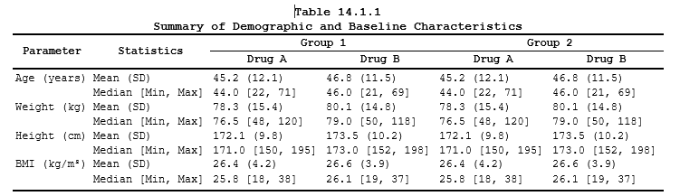

```{r setup, include=FALSE}
knitr::opts_chunk$set(
  comment = "", collapse = TRUE, eval = FALSE,
  dev = "png",
  dev.args = if (capabilities("cairo")) list(type = "cairo") else NULL
)
options(pkgdown.internet = FALSE)
```


<div class="self-numbered" aria-hidden="true"></div>


## Purpose

This vignette presents real-world clinical reporting examples built with ksTFL.
Each example walks through the complete pipeline — from raw input data, through
the R code that constructs the specification object, to the final rendered
document — so you can see how each ingredient maps to the final page.

The examples are ordered by complexity: we start with a demographics table that
introduces core concepts (invisible columns, conditional formatting, section
headers), then move on to multi-language support, complex spanning headers, data
listings with grouping, figure-plus-table pages, and dedicated showcase
examples: a safety forest figure (Example 8), a two-table report page
(Example 9), and a template-skinned laboratory table (Example 10). These
same outputs are the demo tiles on the package site home page.

All code chunks use `eval = FALSE`; the rendered PDFs were pre-generated and are
embedded below. To reproduce an example locally, run the shown code in an R
session with ksTFL loaded and the session setup above applied (the examples
use the magrittr pipe `%>%`, so attach `dplyr` or `magrittr` as in the setup
block).

> **Data note**: Examples 1, 5, 8 and 10 build their input completely in the
> shown code (Example 5 runs on `mtcars`). In the other examples the input
> frame (`data`, `tbl`, `demo_data`, `lab_listing`) is displayed
> as printed output only — it stands for the result of upstream analysis
> programs (ADaM-style summaries). To reproduce those, rebuild an equivalent
> frame from the printed rows (column names and order are what the spec code
> consumes; where a tibble print is truncated, the note says so); the focus
> here is the ksTFL specification layer, not statistics. Example 4 further
> assumes normal-range flags live in columns named `<param>NR` with values
> "high"/"normal"/"low" — the convention its `ends_with("NR")` rules rely on.

## How examples are organised

Every example follows the same structure:

1.  **Input data** — the data frame that feeds `create_table()` or
    `create_figure()`
2.  **Spec-building pipeline** — the ksTFL calls that define the document (with
    inline comments explaining each step)
3.  **Rendered output** — the resulting document embedded as PDF

Example 7 adds a styling technique worth stealing on its own: paragraph
borders (`pb`) instead of cell borders (`bt`/`bb`) under spanning headers,
built by combining atoms with `f_combine()`.

A shared **session setup** block at the top configures page headers, footers,
and output defaults so the examples can stay focused on their unique logic.

Related reading:

-   [Getting Started](Getting_Started_with_ksTFL.html) for the pipeline and
  core concepts.
-   [Reporting Examples](Reporting_Examples_with_ksTFL.html) for smaller,
  feature-by-feature patterns.
-   [Styling Guide](Styling_Guide_with_ksTFL.html) and
  [Advanced StyleRows](Advanced_StyleRows.html) when you need styling or row
  action details.


## Session setup (shared across examples)

Every example in this vignette assumes the following session-wide settings are
in place. They register default headers, footers, output paths, and footnote
behavior once so the individual examples do not need to repeat them:

```{r session_setup, eval = FALSE}
library(ksTFL)
library(dplyr)

tfl_reset_options()
tfl_set_options(
  add_header(c("CRO Example LLC.", "CONFIDENTIAL",
               "Page {PAGE} of {NUMPAGES}")),
  add_header("Study: Miracle Drug 001"),
  add_footer(c("Showcase examples", "Program: inst/examples/showcase")),
  output_directory = '.',
  footnotePlace = "repeated"
)
```


## Example 1 — Demographics table with conditional formatting {#example-01}

Demographics tables are among the most common deliverables in clinical
reporting. They summarise baseline patient characteristics by treatment arm
and typically include section headers, summary statistics, and inferential
test results.

This example shows how ksTFL handles all of that declaratively. The key
techniques demonstrated here are:

-   **Invisible helper columns** — `SECTION`, `SECTION_ID`, and `MODELVAL`
    are kept out of the rendered document but drive conditional logic via
    `compute_cols()`. This is a core ksTFL pattern: your data frame can carry
    metadata columns that the rendering engine never prints but uses to
    control formatting.
-   **`c_addrow()`** — inserts bold section headers (Age, Sex, Race,
    Ethnicity) above the first row of each group, pulling the text straight
    from the hidden `SECTION` column.
-   **`c_merge()` + `c_glue()`** — on p-value rows the treatment columns
    merge into one cell and the p-value is appended, giving the familiar
    centered p-value cell spanning both arms (bare value, e.g. 0.041).
-   **Inline markup** — `<sup>a</sup>` renders the footnote reference
    marker on the population line, inside the text passed to `add_title()`.
-   **`c_pageBreak()`** — forces a break before the last section so the
    long tail of the table opens on a fresh page.
-   **Spacer rows** — `c_addrow("below")` with `row_h4` separates the
    sections visually.

### Input data

The frame has four sections, each ending with a p-value row. `MODELVAL` is
populated only on those rows — `NA` elsewhere — which is how
`compute_cols()` targets them. `SECTION_ID` is derived from the grouping and
drives the spacing and page-break logic:

```{r example_01_data, eval = FALSE}
# --- Input data: a flat analyst frame, one row per statistic ---
# Four parameter sections (Age, Sex, Race, Ethnicity); each ends with a
# p-value row. Values are already in display form - the renderer never
# re-formats what the analyst supplies.
raw <- data.frame(
  SECTION = c(rep("Age (years)", 6), rep("Sex", 3), rep("Race", 4),
              rep("Ethnicity", 3)),
  STAT = c("n", "Mean (SD)", "Median", "Q1; Q3", "Min; Max", "p-value (ANOVA)",
           "Female", "Male", "p-value (Fisher)",
           "White", "Asian", "Black or African American", "p-value (Fisher)",
           "Hispanic or Latino", "Not Hispanic or Latino", "p-value (Fisher)"),
  DRUGX = c("160", "55.2 (12.4)", "54.0", "47.0; 64.0", "18; 82", "",
            "88 (55.0%)", "72 (45.0%)", "",
            "130 (81.2%)", "18 (11.2%)", "12 (7.5%)", "",
            "21 (13.1%)", "139 (86.9%)", ""),
  PLCB  = c("158", "56.0 (11.9)", "55.0", "48.0; 63.0", "20; 81", "",
            "90 (57.0%)", "68 (43.0%)", "",
            "124 (78.5%)", "22 (13.9%)", "12 (7.6%)", "",
            "18 (11.4%)", "140 (88.6%)", ""),
  TOTAL = c("318", "55.6 (12.1)", "54.5", "47.5; 63.5", "18; 82", "",
            "178 (56.0%)", "140 (44.0%)", "",
            "254 (79.9%)", "40 (12.6%)", "24 (7.5%)", "",
            "39 (12.3%)", "279 (87.7%)", ""),
# MODELVAL is a hidden driver column: populated only on p-value rows,
# NA everywhere else. compute_cols() below tests !is.na(MODELVAL) to
# find exactly those rows - no extra flag column needed.
  MODELVAL = c(NA, NA, NA, NA, NA, "0.041",
               NA, NA, ">0.999",
               NA, NA, NA, "0.772",
               NA, NA, "0.664"),
  stringsAsFactors = FALSE)
# Cumulative group index derived from first-seen order of SECTION.
# It drives the spacer rows (lastOf) and the page break (== 4) below,
# and is also hidden from the document.
raw$SECTION_ID <- as.integer(cumsum(!duplicated(raw$SECTION)))
```

The resulting frame:

```
   SECTION                      STAT                    DRUGX         PLCB         TOTAL
1  Age (years)                  n                       160           158          318
2  Age (years)                  Mean (SD)               55.2 (12.4)   56.0 (11.9)  55.6 (12.1)
3  Age (years)                  Median                  54.0          55.0         54.5
4  Age (years)                  Q1; Q3                  47.0; 64.0    48.0; 63.0   47.5; 63.5
5  Age (years)                  Min; Max                18; 82        20; 81       18; 82
6  Age (years)                  p-value (ANOVA)                                     0.041
7  Sex                          Female                  88 (55.0%)    90 (57.0%)   178 (56.0%)
8  Sex                          Male                    72 (45.0%)    68 (43.0%)   140 (44.0%)
9  Sex                          p-value (Fisher)                                    >0.999
10 Race                         White                   130 (81.2%)   124 (78.5%)  254 (79.9%)
11 Race                         Asian                   18 (11.2%)    22 (13.9%)   40 (12.6%)
12 Race                         Black or African Am.    12 (7.5%)     12 (7.6%)    24 (7.5%)
13 Race                         p-value (Fisher)                                    0.772
14 Ethnicity                    Hispanic or Latino      21 (13.1%)    18 (11.4%)   39 (12.3%)
15 Ethnicity                    Not Hispanic or Latino  139 (86.9%)   140 (88.6%)  279 (87.7%)
16 Ethnicity                    p-value (Fisher)                                    0.664
```

### Building the specification

```{r example_01_spec, eval = FALSE}
# --- Building the specification ---
# create_table() takes the flat frame as-is; every presentation concern
# is declared from here on, never baked into the data.
spec <- create_table(raw) %>%
# Multi-line title: table number on line 1, description on line 2.
# toclevel = 1 tags the title for a Table of Contents (the TOC page is
# written when write_doc(toc = TRUE) is used — see Example 4).
  add_title(
    c("Table S1", "Demographic and Baseline Characteristics"),
    toclevel = 1
  ) %>%
# Population line in italics. <sup>a</sup> is inline markup that the
# renderer converts to real Word superscript - the footnote reference.
  add_title("Full Analysis Set<sup>a</sup>", styleRef = "font_italic") %>%
# Footnote body; composition f_combine("fs_8", "fc_gray") assembles the
# style from built-in atoms: 8-point font + gray color.
  add_footnote(
    paste0("<sup>a</sup> Values are shown as n (%), mean (SD), median, or quartiles; ",
           "percentages are based on the number of subjects in the treatment arm."),
    styleRef = f_combine("fs_8", "fc_gray")
  ) %>%
# Hide the three helper columns. They are NOT printed, but stay visible
# to all compute_cols() conditions - the core ksTFL metadata-column
# pattern.
  define_cols(c(SECTION, SECTION_ID, MODELVAL), isVisible = FALSE) %>%
# Stub column: <br> stacks the two label lines; labelStyleRef moves the
# header text left, valueStyleRef indents every value one level so rows
# sit visually under the bold section headers inserted later.
  define_cols(STAT,
    label = "Parameter<br>  Statistic",
    labelStyleRef = "text_left",
    valueStyleRef = "indent_1"
  ) %>%
# The three arms are defined in one batch with vectorised per-column
# values (1-to-N mapping). <br> splits each header into name + (N=...);
# the shared fixed width keeps the arms visually identical.
  define_cols(c(DRUGX, PLCB, TOTAL),
    label = c("DrugX<br>(N=160)", "Placebo<br>(N=158)", "Total<br>(N=318)"),
    valueStyleRef = "text_center",
    colWidth = "16%"
  ) %>%
# 1. Section headers: on the FIRST row of every SECTION run insert a bold
#    row ABOVE it, pulling the text straight from the hidden SECTION
#    column - zero duplicated strings in the data.
  compute_cols(
    firstOf(SECTION),
    c_addrow("above", value_from = SECTION, styleRef = "font_bold")
  ) %>%
# 2. p-value rows, three actions in one rule, evaluated left to right:
#    merge DrugX+Placebo into one centered italic cell with a thin top
#    border, italicise the statistic label, then glue the p-value text
#    after the merged cell - the centered "0.041" display.
  compute_cols(
    !is.na(MODELVAL),
    c_merge(c(DRUGX, PLCB), styleRef = f_combine("text_center", "bt_th", "i")),
    c_style(STAT, "i"),
    c_glue(DRUGX, "after", glue_col = MODELVAL)
  ) %>%
# 3. Spacers: an empty 4-point row below each section gives the eye rest.
#    lastOf() is run-length-aware: it fires on the LAST row of each run.
  compute_cols(
    lastOf(SECTION_ID),
    c_addrow("below", styleRef = "row_h4")
  ) %>%
# 4. Page break: the table is long, so the Ethnicity section (id 4)
#    deliberately starts on a fresh page instead of being split by Word.
  compute_cols(
    SECTION_ID == 4 & firstOf(SECTION_ID),
    c_pageBreak()
  ) %>%
# Document-level polish: 75% content width centers the table as a
# typographic choice; the zero empty lines remove the template's
# default blank rows above and below the body.
  set_document(
    contentWidth = "75%",
    topEmptyLine = "0pt",
    bottomEmptyLine = "0pt"
  )
```

### Render

```{r example_01_render, eval = FALSE}
# Two calls, two roles: create_report() runs the whole pipeline -
# style resolution, conditional rules, pagination - and write_doc()
# emits the file. Nothing between them to babysit.
create_report(spec) %>% write_doc('example_01')
```

### Rendered output

[Open example_01.pdf](example_01.pdf)

<iframe src="example_01.pdf" title="example_01.pdf preview" width="100%" height="600px" style="border: 1px solid #ccc;"></iframe>

### Switching style templates

The example above uses the default embedded style template. One of ksTFL's
design principles is that **content and styling are separate**: you can
switch to a completely different visual theme by changing a single parameter
on an already-built spec, without touching any data or conditional logic:

```{r example_01_navy, eval = FALSE}
# One option swaps the entire corporate look: fonts, colors, borders
# all come from the named template. Data and conditional logic are
# untouched - styling is separable from content by design.
spec <- set_document(spec, docTemplate = 'Navy_Pro')
create_report(spec) %>% write_doc('example_01_navy')
```

The same table now wears the `Navy_Pro` template — different fonts,
colours, and borders, identical content and structure:

[Open example_01_navy.pdf](example_01_navy.pdf)

<iframe src="example_01_navy.pdf" title="example_01_navy.pdf preview" width="100%" height="600px" style="border: 1px solid #ccc;"></iframe>

**Key take-aways from this example:**

-   **Invisible columns** — `SECTION`, `SECTION_ID`, and `MODELVAL` never
    appear in the document, yet they drive all the conditional logic.
-   **`c_addrow(value_from = ...)`** pulls text from a hidden column into a
    inserted header row — no manual string duplication.
-   **`c_merge()` + `c_glue()`** combine cells and append content from
    another column in one `compute_cols()` call.
-   **Inline `<sup>` markup** carries the footnote reference into the title.
-   **`c_pageBreak()`** and **`row_h4` spacers** give precise control over
    pagination and whitespace.
-   **Template switching** re-skins the whole output via one option.

## Example 2 — Demographics table (UTF-8 encoding support) {#example-02}

Clinical trials run in many countries, and regulatory submissions often require
documents in local languages. ksTFL has full UTF-8 support — titles, footnotes,
column labels, and data values can all contain non-Latin characters without any
special configuration.

This example reproduces the same demographics table structure from Example 1,
but entirely in Russian. The code also serves as a detailed walkthrough of the
spec-building pipeline, with comments explaining every step.

### Input data

```         
# A tibble: 32 × 7
   CAT1          CAT2                     RPH104        PLCB          TOTAL         modelval SECTORD1
   <chr>         <chr>                    <chr>         <chr>         <chr>         <chr>       <dbl>
 1 Возраст (лет) n                        "16"          "17"          "33"          NA              1
 2 Возраст (лет) Сред. (СО)               "30.9 (11.3)" "41.6 (11.9)" "36.4 (12.6)" NA              1
 3 Возраст (лет) Медиана                  "28.0"        "40.0"        "33.0"        NA              1
 4 Возраст (лет) Q1; Q3                   "22.5; 36.5"  "33.0; 48.0"  "26.0; 45.0"  NA              1
 5 Возраст (лет) Мин.; Макс.              "18; 57"      "21; 59"      "18; 59"      NA              1
 6 Возраст (лет) p-величина (ANOVA μ₁=μ₂) ""            ""            ""            0.013           1
 7 Пол           Женский                  " 6 ( 37.5%)" " 7 ( 41.2%)" "13 ( 39.4%)" NA              2
 8 Пол           Мужской                  "10 ( 62.5%)" "10 ( 58.8%)" "20 ( 60.6%)" NA              2
 9 Пол           p-величина (Фишер)       ""            ""            ""            >0.999          2
10 Раса          Белые                    "16 (100.0%)" "17 (100.0%)" "33 (100.0%)" NA              3
```

### Code

The pipeline follows the same pattern as Example 1: create table →
titles/footnotes → hide helper columns → define visible columns → conditional
row transforms → document settings. Reading the inline comments below alongside
Example 1 will help you see the one-to-one correspondence:

```{r example_02_render, eval = FALSE}
# --- Build the specification object ---

drg_N   <- 16
plcb_N  <- 17
total_N <- 33

spec_dm_01 <- create_table(data) %>% 
  add_title(
    c("Таблица 1.2",
      "Демографические и другие исходные характеристики"),
    toclevel = 1
  ) %>% 
  add_title("Популяция FAS", styleRef = 'font_italic') %>% 
  add_footnote('Источник: Перечень 16.3; Перечень 16.33') %>% 
  # The CAT1 variable holds the category name. We want those
  # names to appear in the CAT2 column as section headers,
  # so we hide CAT1. We also hide the helper columns SECTORD1
  # and modelval (whose values we place into other cells):
  
  define_cols(c(CAT1, SECTORD1, modelval), isVisible = F) %>% 
  # First value of each CAT1 group becomes an extra header row:
  compute_cols(
    # built-in helper: first value within a group
    # (can also define composite groups from several variables)
    firstOf(CAT1),
    # Insert a bold row above with the value from CAT1
    c_addrow('above',
             value_from = CAT1,
             styleRef = 'font_bold')
  ) %>% 
  ## Indent CAT2 values to the right relative to the header.
  ## This can be done in two ways...
  # Method 1: via a per-row rule:
  #   compute_cols(!is.na(CAT2), c_style(CAT2, 'indent_1'))
  # Method 2: by setting the column style directly.
  #   Method 2 is preferable here because we apply the same
  #   style to every value in the column; doing it per-row via
  #   compute_cols creates unnecessary rendering overhead.
  # We also define the column label and header style:
  define_cols(CAT2,
              label = 'Параметр<br>  Статистика',
              valueStyleRef = 'indent_1',
              labelStyleRef = 'text_left') %>% 
  # Labels for the remaining treatment-arm columns:
  define_cols(c(RPH104, PLCB, TOTAL),
              label = c(
                paste0('Drug-001', '<br>(N=', drg_N, ')'),
                paste0('Плацебо', '<br>(N=', plcb_N, ')'),
                paste0('Всего', '<br>(N=', total_N, ')')
              ),
              # center arms; the everything() pass below layers 8 pt on
              # top of these styles without touching alignment
              valueStyleRef = 'text_center',
              colWidth = '15%'
  ) %>% 
  define_cols(everything(), valueStyleRef = 'fs_8') %>% 
  # Display modelval in a merged cell spanning RPH104 + PLCB:
  compute_cols(
    !is.na(modelval),
    # Merge cells; centre the value and draw a thin top border
    # to show it relates to both treatment columns:
    c_merge(c(RPH104, PLCB),
            styleRef = f_combine('text_center', 'bt_th', 'i')),
    c_style(CAT2, 'i'),
    # Append modelval into the merged cell
    c_glue(RPH104, 'after', glue_col = modelval)
  ) %>% 
  # Separators between groups
  compute_cols(
    lastOf(SECTORD1),
    c_addrow('below', styleRef = 'row_h4')
  ) %>% 
  # Manual page break: first 3 categories on page one,
  # the rest on page two:
  compute_cols(
    SECTORD1 == 4 & firstOf(SECTORD1),
    c_pageBreak()
  ) %>% 
  set_document(
    contentWidth = '75%',
    # Place footnotes in the document footer section
    footnotePlace = 'doc_footer',
    # Use an alternative embedded template
    docTemplate = 'Classic_landscape_times'
  ) 

  create_report(spec_dm_01) %>% write_doc("example_02_demog")
```

### Rendered output

[Open example_02_demog.pdf](example_02_demog.pdf)

<iframe src="example_02_demog.pdf" title="example_02_demog.pdf preview" width="100%" height="600px" style="border: 1px solid #ccc;"></iframe>

## Example 3 — Adverse Events table with complex spanning headers {#example-03}

Adverse Event (AE) frequency tables are a staple of clinical safety reporting.
They often have many columns (treatment periods, follow-up windows, overall
totals) arranged under multi-level spanning headers.

This example demonstrates:

-   **Three-tier spanning headers** via `add_span_header()` with `stubOrder` to
    stack period sub-headers, a follow-up banner, and a top-level drug-arm
    header.
-   **Custom page layout** — landscape A4 with tight margins to fit 14 numeric
    columns plus two identifier columns.
-   **`isID = TRUE`** — marks columns that should repeat on every page when the
    table spans multiple pages.
-   **Conditional formatting** — bold SOC-level totals, inserted header rows per
    System Organ Class, and a forced page break between the "Any AE" summary and
    per-SOC detail.

### Input data

```         
# A tibble: 18 × 17  (print truncated — the frame also carries GRAND_N, GRAND_E)
   SOC_GROUP SOC_PT  SEVERITY TRT_N TRT_E FU_0_6_N FU_0_6_E FU_GT6_N FU_GT6_E FU_0_8_N FU_0_8_E FU_GT8_N FU_GT8_E FU_TOTAL_N FU_TOTAL_E
   <chr>     <chr>   <chr>    <chr> <chr> <chr>    <chr>    <chr>    <chr>    <chr>    <chr>    <chr>    <chr>    <chr>      <chr>     
 1 Any AE    "Any A… ""       142 … 327   56 (31.… 71       93 (51.… 122      77 (42.… 103      75 (41.… 90       121 (67.2) 193       
 2 Any AE    ""      "1: Mil… 110 … 159   31 (17.… 34       59 (32.… 67       42 (23.… 49       46 (25.… 52       84 (46.7)  101       
 3 Any AE    ""      "2: Mod… 75 (… 94    17 (9.4) 18       25 (13.… 26       24 (13.… 25       18 (10.… 19       38 (21.1)  44        
 4 Any AE    ""      "3: Sev… 48 (… 51    12 (6.7) 12       17 (9.4) 18       20 (11.… 20       10 (5.6) 10       27 (15.0)  30        
 5 Any AE    ""      "4: Lif… 12 (… 13    4 (2.2)  4        7 (3.9)  7        5 (2.8)  5        6 (3.3)  6        11 (6.1)   11        
 6 Any AE    ""      "5: Dea… 9 (5… 10    3 (1.7)  3        4 (2.2)  4        4 (2.2)  4        3 (1.7)  3        7 (3.9)    7         
 7 SOC1      ""      ""       117 … 206   34 (18.… 35       60 (33.… 71       47 (26.… 55       46 (25.… 51       82 (45.6)  106       
 8 SOC1      ""      "1: Mil… 74 (… 101   18 (10.… 18       37 (20.… 39       23 (12.… 25       30 (16.… 32       52 (28.9)  57        
 9 SOC1      ""      "2: Mod… 50 (… 57    9 (5.0)  9        15 (8.3) 15       15 (8.3) 15       9 (5.0)  9        23 (12.8)  24        
10 SOC1      ""      "3: Sev… 31 (… 33    6 (3.3)  6        11 (6.1) 12       13 (7.2) 13       5 (2.8)  5        16 (8.9)   18        
11 SOC1      ""      "4: Lif… 8 (4… 8     0 (0.0)  0        3 (1.7)  3        0 (0.0)  0        3 (1.7)  3        3 (1.7)    3         
12 SOC1      ""      "5: Dea… 7 (3… 7     2 (1.1)  2        2 (1.1)  2        2 (1.1)  2        2 (1.1)  2        4 (2.2)    4         
13 SOC2      ""      ""       89 (… 121   31 (17.… 36       44 (24.… 51       40 (22.… 48       34 (18.… 39       68 (37.8)  87        
14 SOC2      ""      "1: Mil… 54 (… 58    13 (7.2) 16       26 (14.… 28       20 (11.… 24       18 (10.… 20       38 (21.1)  44        
15 SOC2      ""      "2: Mod… 32 (… 37    9 (5.0)  9        10 (5.6) 11       10 (5.6) 10       9 (5.0)  10       18 (10.0)  20        
16 SOC2      ""      "3: Sev… 18 (… 18    6 (3.3)  6        6 (3.3)  6        7 (3.9)  7        5 (2.8)  5        11 (6.1)   12        
17 SOC2      ""      "4: Lif… 5 (2… 5     4 (2.2)  4        4 (2.2)  4        5 (2.8)  5        3 (1.7)  3        8 (4.4)    8         
18 SOC2      ""      "5: Dea… 2 (1… 3     1 (0.6)  1        2 (1.1)  2        2 (1.1)  2        1 (0.6)  1        3 (1.7)    3         
```

### Code

```{r example_03_render, eval = FALSE}
# --- Build the table specification ---
# N = total subjects in the arm (define it wherever you keep study constants;
# the example uses the artifact value 180)
N <- 180
spec <- create_table(tbl) %>%

  # --- Custom styles ---
  # Define a smaller font size for the dense numeric columns,
  # and extra spacing after the title block for readability.
  add_style("font_small", s_font(font_size = "8pt")) %>%
  add_style("spacing_after10",
    s_paragraph(spacing = s_spacing(after = "10pt"))
  ) %>%

  # --- Title block ---
  # Three-line title: table number, full description, and population label.
  # toclevel = 1 adds it to the Table of Contents.
  add_title(c(
    "Table 11.32",
    "Frequency of AEs by System Organ Class, and Severity.",
    "SS Sub-population, Primary Enrolment into OLE"
  ), toclevel = 1, styleRef = "spacing_after10") %>%

  # --- Page layout ---
  # Dynamic page numbering in the footer
  add_footer("", "Page {PAGE} of {NUMPAGES}", "") %>%
  # Landscape A4 with tight margins — necessary to fit 16 columns
  set_page_style(
    page = p_page(
      size = "A4",
      orientation = "landscape",
      margins = p_margins(
        top = "12mm",
        bottom = "12mm",
        left = "5mm",
        right = "5mm",
        header = "8mm",
        footer = "8mm"
      )
    )
  ) %>%

  # --- Column definitions ---
  # Hide SOC_GROUP — it is used only by compute_cols() to insert
  # bold SOC header rows and trigger page breaks between groups.
  define_cols(SOC_GROUP, isVisible = FALSE) %>%

  # SOC / Preferred Term: left-aligned, repeats on page breaks (isID = TRUE)
  # so readers always know which SOC they are looking at.
  define_cols(SOC_PT,
              label = "MedDRA SOC",
              isID = TRUE,
              labelStyleRef = "text_left",
              valueStyleRef = f_combine("text_left", "font_small"),
              colWidth = "18%"
  ) %>%
  # Severity column: also repeats on continuation pages.
  define_cols(SEVERITY,
              label = "Severity",
              isID = TRUE,
              labelStyleRef = "text_left",
              valueStyleRef = f_combine("text_left", "font_small"),
              colWidth = "13%"
  ) %>%
  # All 14 numeric columns share the same layout: centred, small font,
  # equal width. The label vector alternates "n (%)" and "E" (events).
  define_cols(
    c(
      TRT_N, TRT_E,
      FU_0_6_N, FU_0_6_E,
      FU_GT6_N, FU_GT6_E,
      FU_0_8_N, FU_0_8_E,
      FU_GT8_N, FU_GT8_E,
      FU_TOTAL_N, FU_TOTAL_E,
      GRAND_N, GRAND_E
    ),
    label = rep(c("n (%)", "E"), 7),   # each metric pair: count(%) + events
    # Rotate labels with f_combine("text_center", "to_90") if the page gets
    # tight (see Example 4); this table fits without rotation.
    labelStyleRef = "text_center",
    valueStyleRef = f_combine("text_center", "font_small"),
    colWidth = "4.3%"
  ) %>%

  # --- Multi-level spanning headers (3 tiers) ---
  # Spanning headers group columns visually. stubOrder controls the
  # vertical stacking order (1 = closest to column labels, 3 = top).

  # Tier 1 (stubOrder = 1): individual period sub-headers
  add_span_header(
    cols = c(TRT_N, TRT_E),
    label = "Treatment Period<br>n (%)",
    stubOrder = 1
  ) %>%
  add_span_header(
    cols = c(GRAND_N, GRAND_E),
    label = "Overall<br>n (%)",
    stubOrder = 1
  ) %>%
  add_span_header(
    cols = c(FU_0_6_N, FU_0_6_E),
    label = "0-6 wks after<br>last dose",
    stubOrder = 1
  ) %>%
  add_span_header(
    cols = c(FU_GT6_N, FU_GT6_E),
    label = ">6 wks after<br>last dose",
    stubOrder = 1
  ) %>%
  add_span_header(
    cols = c(FU_0_8_N, FU_0_8_E),
    label = "0-8 wks after<br>last dose",
    stubOrder = 1
  ) %>%
  add_span_header(
    cols = c(FU_GT8_N, FU_GT8_E),
    label = ">8 wks after<br>last dose",
    stubOrder = 1
  ) %>%
  add_span_header(
    cols = c(FU_TOTAL_N, FU_TOTAL_E),
    label = "Total",
    stubOrder = 1
  ) %>%
  # Tier 2 (stubOrder = 2): groups all follow-up sub-periods under one
  # banner, making it clear that the five sub-columns all belong to
  # the Safety Follow-up Period.
  add_span_header(
    cols = c(FU_0_6_N, FU_0_6_E, FU_GT6_N, FU_GT6_E, 
             FU_0_8_N, FU_0_8_E, FU_GT8_N, FU_GT8_E, FU_TOTAL_N, FU_TOTAL_E),
    label = "Safety Follow-up Period<br>n (%)",
    stubOrder = 2
  ) %>%
  # Tier 3 (stubOrder = 3): top-level drug arm header spanning all
  # numeric columns. The label is a two-element vector (drug name + N).
  add_span_header(
    cols = c(
      TRT_N, TRT_E,
      FU_0_6_N, FU_0_6_E, FU_GT6_N, FU_GT6_E,
      FU_0_8_N, FU_0_8_E, FU_GT8_N, FU_GT8_E,
      FU_TOTAL_N, FU_TOTAL_E,
      GRAND_N, GRAND_E
    ),
    label = c("DrugX", sprintf("N=%d", N)),
    stubOrder = 3) %>%

  # --- Conditional row actions ---
  # Insert a bold SOC header row above the first row of each SOC group.
  # The "Any AE" group already has its own label in the data, so we skip it.
  compute_cols(
    firstOf(SOC_GROUP) & SOC_GROUP != "Any AE",
    c_addrow("above", value_from = SOC_GROUP, styleRef = "font_bold")
  ) %>%
  # Force a page break before SOC1 so the "Any AE" summary stands alone
  # on the first page and per-SOC detail starts on a fresh page.
  compute_cols(
    SOC_GROUP == "SOC1" & firstOf(SOC_GROUP),
    c_pageBreak()
  ) %>%
  # Bold the SOC-level totals: rows where SEVERITY is blank are the
  # SOC total across all grades (not broken down by severity).
  compute_cols(
    SEVERITY == "",
    c_style(c(SOC_PT, SEVERITY), styleRef = "font_bold")
  ) %>%
  # Use a regulatory-style template (Arial font, conservative borders)
  set_document(docTemplate = 'Regulatory_Arial')

## Write the document
create_report(spec) %>% write_doc("example_03_ae")
```

### Rendered output

[Open example_03_ae.pdf](example_03_ae.pdf)

<iframe src="example_03_ae.pdf" title="example_03_ae.pdf preview" width="100%" height="600px" style="border: 1px solid #ccc;"></iframe>

## Example 4 — Data listing with automatic two-level TOC {#example-04}

Data listings present individual patient records with minimal aggregation. They
often run to hundreds of pages, so navigation features become essential. This
example demonstrates:

-   **`isGrouping = TRUE`** — marks columns as grouping variables. When grouping
    columns change value, ksTFL inserts a page break and generates a new
    sub-entry in the Table of Contents.
-   **Dynamic subtitles** — `#ByGroup1`, `#ByGroup2`, etc. are placeholders that
    get replaced with the current group values, producing "Subject: 01001, Sex:
    M, Age (years): 26" automatically.
-   **Two-level TOC** — the title and subtitle together create a nested TOC:
    listing title at level 1, per-subject entries at level 2.
-   **Value-dependent formatting** — `compute_cols()` reads the hidden
    `<param>NR` flag columns and appends a green superscript L or red
    superscript H to out-of-range results.
-   **Rotated column labels** — `to_90` rotates headers 90° to save horizontal
    space for the many narrow lab-parameter columns.

### Input data

```         
# A tibble: 550 × 16
        ID AGE SEX     TRT    VISIT       DATE   ALT  ALTNR   AST  ASTNR BILI BILINR  HGB  HGBNR  PH WBCU
1  SUBJ001  45   M  Drug A Baseline 2024-08-02 162.6   high  62.9   high 0.78 normal 14.1 normal 6.6    -
2  SUBJ001  45   M  Drug A  Visit 1 2024-08-14  89.2   high 153.5   high 1.12 normal 13.7 normal 6.4  +++
3  SUBJ001  45   M  Drug A  Visit 2 2024-08-30 154.3   high 110.7   high 0.97 normal 13.9 normal 6.8    -
4  SUBJ001  45   M  Drug A  Visit 3 2024-09-12 171.4   high 116.1   high 0.69 normal   NA   <NA> 5.5   ++
5  SUBJ001  45   M  Drug A  Visit 4 2024-09-29 203.1   high  69.0   high 0.37 normal 12.9 normal 6.2    -
6  SUBJ001  45   M  Drug A  Visit 5 2024-10-22 231.4   high  65.0   high 0.54 normal 13.9 normal 6.4    +
7  SUBJ001  45   M  Drug A  Visit 6 2024-11-25  82.3   high 104.7   high 1.91   high 11.9    low 6.6    -
8  SUBJ001  45   M  Drug A  Visit 7 2024-12-22 145.7   high  64.9   high 0.80 normal 13.5 normal 5.5    -
9  SUBJ001  45   M  Drug A  Visit 8 2025-01-16  69.8   high  64.4   high 0.96 normal 14.1 normal 5.1    -
10 SUBJ001  45   M  Drug A  Visit 9 2025-02-16 189.4   high  58.3   high 0.68 normal 15.3 normal 6.9    +
11 SUBJ001  45   M  Drug A Visit 10 2025-03-16 167.7   high  99.8   high 1.34   high 13.7 normal 5.5    -
12 SUBJ002  39   F  Drug A Baseline 2024-01-28  34.7 normal  24.5 normal 0.80 normal 17.4   high 6.4    -
13 SUBJ002  39   F  Drug A  Visit 1 2024-02-13  17.1 normal  22.0 normal 0.50 normal 12.4 normal 5.6    -
14 SUBJ002  39   F  Drug A  Visit 2 2024-02-26  31.5 normal  19.3 normal 0.89 normal 13.4 normal 6.3    +
15 SUBJ002  39   F  Drug A  Visit 3 2024-03-10  42.0   high  11.9 normal 0.52 normal 13.0 normal 6.8    -
```

### Code

```{r example_04_render, eval = FALSE}
spec_lbl_01 <- create_table(lab_listing) %>%
	
	# --- Title and dynamic subtitle ---
	# toclevel = 1 creates the top-level TOC entry for this listing.
	add_title(c("Listing 16.1", "Laboratory Data"), toclevel = 1) %>%
	# Dynamic subtitle: #ByGroup1/2/3 are replaced at render time with the
	# current values of the grouping columns (ID, AGE, SEX).
	# toclevel = 2 creates a nested TOC entry per subject.
	add_subtitle(
		"Subject: #ByGroup1, Sex: #ByGroup3, Age (years): #ByGroup2",
		toclevel = 2
	) %>%
	add_footnote('H, L - Value Outside Normal Ranges') %>%
	
	# --- Column definitions ---
	# Hide subject-level columns and mark them as grouping variables.
	# isGrouping = TRUE triggers automatic page breaks when any of these
	# columns change value, and populates the #ByGroupN placeholders.
	define_cols(
		c(ID, SEX, AGE),
		isVisible = FALSE, 
		isGrouping = TRUE
	) %>%
	
	# Lab parameter columns: rotated 90° headers (to_90), left-aligned,
	# top-aligned (va_t).
	define_cols(
		c(-TRT, -VISIT, -DATE),
		labelStyleRef = f_combine(
			'al', 'va_t', 'to_90'
		)
	) %>%
	
	# Identifier columns: Treatment, Visit 
	define_cols(c(TRT, VISIT, DATE),
							label = c('Treatment', 'Visit', 'Date'),
							valueStyleRef = 'i' # Italicise Treatment and Visit values for visual distinction
	) %>% 
	#Hide Normal Ranges columns - we will use them to mark the lab value itself
	define_cols( ends_with('NR'),	isVisible = FALSE	) %>% 
	# Lab parameter columns (positions 7-15): narrow equal
	# widths, descriptive labels
	define_cols(c(ALT, AST, BILI, HGB, PH, WBCU),
							colWidth = '7%', #set equal width for all result columns
							label = c('ALT (U/L)', 'AST (U/L)',
								'Bilirubin (g/dL)', 'Hemoglobin (g/dL)', 
								'pH',	'Leukocytes, urine (/HPF)'
							),
							missings = 'NC' #defines how to report NA values
	) %>%
	
	# --- Conditional formatting ---
	# Flag abnormal ALT values: if ALTNR is Low append 'L' to the value, 
	#                           if is High append 'H' to the value
	compute_cols(
			!is.na(ALTNR) & ALTNR == 'low',
			c_style(ALT, styleRef = 'fc_green'),
			c_glue(ALT, 'after', text = '<sup>L</sup>')
	) %>%
	compute_cols(
			!is.na(ALTNR) & ALTNR == 'high',
			c_style(ALT, styleRef = 'fc_red'),
			c_glue(ALT, 'after', text = '<sup>H</sup>')
		) %>%
	# Repeat the same trick with other result 
	compute_cols(
		!is.na(ASTNR) & ASTNR == 'low',
		c_style(AST, styleRef = 'fc_green'),
		c_glue(AST, 'after', text = '<sup>L</sup>')
	) %>%
	compute_cols(
		!is.na(ASTNR) & ASTNR == 'high',
		c_style(AST, styleRef = 'fc_red'),
		c_glue(AST, 'after', text = '<sup>H</sup>')
	) %>%
	compute_cols(
		!is.na(HGBNR) & HGBNR == 'low',
		c_style(HGB, styleRef = 'fc_green'),
		c_glue(HGB, 'after', text = '<sup>L</sup>')
	) %>%
	compute_cols(
		!is.na(HGBNR) & HGBNR == 'high',
		c_style(HGB, styleRef = 'fc_red'),
		c_glue(HGB, 'after', text = '<sup>H</sup>')
	) %>%
	compute_cols(
		!is.na(BILINR) & BILINR == 'low',
		c_style(BILI, styleRef = 'fc_green'),
		c_glue(BILI, 'after', text = '<sup>L</sup>')
	) %>%
	compute_cols(
		!is.na(BILINR) & BILINR == 'high',
		c_style(BILI, styleRef = 'fc_red'),
		c_glue(BILI, 'after', text = '<sup>H</sup>')
	) %>% 
	# --- Document settings ---
	set_document(
		docTemplate = 'Default',
		topEmptyLine = '6pt',
		bottomEmptyLine = '6pt',
  
	)

## Write the document with a Table of Contents page
create_report(spec_lbl_01) %>% write_doc("example_04_list", toc = TRUE)

```

### Rendered output

[Open example_04_list.pdf](example_04_list.pdf)

<iframe src="example_04_list.pdf" title="example_04_list.pdf preview" width="100%" height="600px" style="border: 1px solid #ccc;"></iframe>

### Splitting long tables across pages

When a table has too many columns to fit on one page, ksTFL can automatically
split the columns across multiple pages. The `isColBreak` parameter on
`define_cols()` tells the engine where to start a new column page. Columns
marked with `isID = TRUE` repeat on every column-page, ensuring the reader
always sees the identifying context.

For example, adding a column break at `PH` splits the listing into two
column groups: the first page carries the identifying context (Treatment,
Visit, Date) with ALT, AST, Bilirubin and Hemoglobin, the second continues
with pH, Leukocytes and the urine panel:

```{r example_04_colbreak, eval = FALSE}
spec_lbl_02 <- spec_lbl_01 %>%
  # Add a column break at PH — all columns from PH onward move to a new page.
  # The Treatment, Visit, and Date columns (isID = TRUE) repeat automatically.
  define_cols(PH, isColBreak = TRUE)

create_report(spec_lbl_02) %>% write_doc("example_04_list_colbr", toc = TRUE)
```

### Split rendered output

[Open example_04_list_colbr.pdf](example_04_list_colbr.pdf)

<iframe src="example_04_list_colbr.pdf" title="example_04_list_colbr.pdf preview" width="100%" height="600px" style="border: 1px solid #ccc;"></iframe>

## Example 5 — Figures and combined multi-spec reports with TOC {#example-05}

ksTFL is not limited to tables. The `create_figure()` function wraps a ggplot2
object (or an image file path) into a `TFL_spec`, which can then receive titles,
subtitles, footnotes, and document settings just like a table.

The real power shows when you combine multiple specs into a single document.
`create_report()` accepts any number of `TFL_spec` objects — tables, figures,
and text — and merges them into one report. When `write_doc()` is called with
`toc = TRUE`, a Table of Contents is generated automatically from the `toclevel`
values set in titles.

This example creates three ggplot2 figures and writes them into a single
landscape document with a TOC page.

### Code

```{r example_05_render, eval = FALSE}
library(ggplot2)

# --- Figure 1: Fuel efficiency scatter plot from mtcars ---
# A straightforward scatter plot coloured by cylinder count.
t.fig <- ggplot(mtcars, aes(x = wt, y = mpg, colour = factor(cyl))) +
  geom_point(size = 3, alpha = 0.8) +
  scale_colour_manual(
    name   = "Cylinders",
    values = c("4" = "#2166AC", "6" = "#F4A582", "8" = "#D6604D")
  ) +
  labs(
    x = "Weight (1000 lbs)",
    y = "Miles per Gallon"
  ) +
  theme_bw(base_size = 11) +
  theme(legend.position = "bottom")

# Wrap the ggplot in a figure spec, then add titles and footnotes.
# toclevel = 1 adds this figure to the TOC.
t.fig.spec <- t.fig %>% create_figure() %>%
  add_title(
    c("Study Motor Trend",
      "Figure 1: Fuel Efficiency by Vehicle Weight"),
    toclevel = 1
  ) %>%
  add_subtitle("All vehicles, 1974") |>
  add_footnote("Source: 1974 Motor Trend US magazine (n = 32 vehicles).")

# figureScaleMode = "fitPage" scales the image to fill the available area:
# the session figureWidth/figureHeight are deliberately ignored in this mode
# (the renderer computes the size from page bounds — a warning documents it).
t.fig.spec <- t.fig.spec %>%
  set_document(figureScaleMode = "fitPage",
               docTemplate = "Classic_landscape_times")

# --- Figure 2: Iris petal dimensions by species (violin + jitter) ---
# Violin plots show the distribution shape; jittered points show
# individual observations. Legend is turned off because species
# identity is clear from the x-axis labels.
t.fig2 <- ggplot(iris, aes(x = Species, y = Petal.Length, fill = Species)) +
  geom_violin(alpha = 0.4, colour = NA) +
  geom_jitter(aes(colour = Species), width = 0.15, size = 1.5, alpha = 0.7) +
  scale_fill_manual(values = c("setosa" = "#66C2A5", "versicolor" = "#FC8D62",
                                "virginica" = "#8DA0CB")) +
  scale_colour_manual(values = c("setosa" = "#66C2A5", "versicolor" = "#FC8D62",
                                  "virginica" = "#8DA0CB")) +
  labs(x = NULL, y = "Petal Length (cm)") +
  theme_minimal(base_size = 11) +
  theme(legend.position = "none")

t.fig.spec2 <- t.fig2 %>% create_figure() %>%
  add_title(
    c("Study Iris",
      "Figure 2: Petal Length Distribution by Species"),
    toclevel = 1
  ) %>%
  add_subtitle("Anderson's Iris data set (n = 150)") |>
  add_footnote(
    "Each point represents one flower. Violin width shows density."
  ) %>%
  set_document(figureScaleMode = "fitPage",
               docTemplate = "Classic_landscape_times")

# --- Figure 3: Displacement vs horsepower (bubble + LOESS smooth) ---
# Bubble size encodes quarter-mile time; fill colour encodes transmission
# type (automatic vs manual). A LOESS curve with 95% CI ribbon shows
# the overall trend.
t.fig3 <- ggplot(mtcars, aes(x = disp, y = hp)) +
  geom_smooth(method = "loess", formula = y ~ x,
              se = TRUE, colour = "#B2182B", fill = "#FDDBC7", alpha = 0.3) +
  geom_point(aes(size = qsec, fill = factor(am)),
             shape = 21, alpha = 0.75, colour = "grey30") +
  scale_fill_manual(name = "Transmission",
                    values = c("0" = "#4393C3", "1" = "#D6604D"),
                    labels = c("0" = "Automatic", "1" = "Manual")) +
  scale_size_continuous(name = "1/4 Mile Time (s)", range = c(2, 8)) +
  labs(x = "Displacement (cu. in.)", y = "Horsepower") +
  theme_bw(base_size = 11) +
  theme(legend.position = "bottom",
        legend.box = "vertical",
        legend.margin = margin(t = 2, b = 2),
        legend.spacing.y = unit(2, "pt"))

t.fig.spec3 <- t.fig3 %>% create_figure() %>%
  add_title(c("Study Motor Trend",
              "Figure 3: Displacement vs Horsepower"), toclevel = 1) %>%
  add_subtitle("Bubble size = quarter-mile time; colour = transmission type") |>
  add_footnote(
    paste("LOESS curve with 95% CI shown in red.",
          "Source: 1974 Motor Trend US magazine.")
  ) %>%
  set_document(figureScaleMode = "fitPage",
               docTemplate = "Classic_landscape_times")

# --- Combine all three figures into a single document ---
# create_report() accepts any number of TFL_spec objects.
# write_doc() with toc = TRUE generates a Table of Contents from
# the toclevel values set in each spec's title.
t.fig.report <- create_report(t.fig.spec, t.fig.spec2, t.fig.spec3)

write_doc(t.fig.report, "example_05_figures_single_doc_toc", toc = TRUE)
```

### Rendered output

The resulting document contains a TOC page listing all three figures, followed
by one page per figure. Each figure fills the landscape page thanks to
`figureScaleMode = "fitPage"`.

[Open example_05_figures_single_doc_toc.pdf](example_05_figures_single_doc_toc.pdf)

<iframe src="example_05_figures_single_doc_toc.pdf" title="example_05_figures_single_doc_toc.pdf preview" width="100%" height="600px" style="border: 1px solid #ccc;"></iframe>

## Example 6 — Concentration-time figure with a parameter table {#example-06}

A frequent CSR pattern is a summary table printed directly beneath its
figure — a PK concentration-time profile followed by its derived
parameters. Two specs (figure + table) merge into a single report;
`continuousSection` lets them share one page instead of starting a new one.

**Key design principles:**

- **One report, two documents** — `create_report(spec_fig, spec_tbl)`
  merges figure and table into one `.docx`; each keeps its own titles and
  footnotes, so the Table of Contents can list both entries.
- **Continuous flow** — both specs carry `continuousSection = TRUE`, so
  the table follows the figure on the same landscape sheet.
- **Sizing** — `figureHeight = "3.2in"` was dialed for this landscape
  sheet so figure + table + titles + footnote fit one page; on a different
  template or orientation, remeasure — Word breaks to a fresh sheet when
  the combined height exceeds one page.
- **`<br>` in column labels** — `Cmax (ng/mL)<br>mean (SD)` stacks the
  statistic over the unit for a compact header.

### Data

```{r example_06_data, eval = FALSE}
# --- Simulated single-dose PK profile ---
# Nine sampling times over 24 h for four treatment arms.
times <- c(0, 0.5, 1, 2, 4, 6, 8, 12, 24)
pk <- do.call(rbind, lapply(c("Placebo", "Drug X 50 mg", "Drug X 100 mg", "Drug X 200 mg"), function(trt) {
# Dose-proportional expected Cmax per arm; placebo carries only assay
# background noise.
  peak <- switch(trt, "Placebo" = 0, "Drug X 50 mg" = 21, "Drug X 100 mg" = 43, "Drug X 200 mg" = 66)
# Classic absorption/elimination curve (rates ka and ke) plus small
# normally distributed measurement error - a believable profile shape.
  ka <- 1.35; ke <- 0.16
  data.frame(TRT = trt, TIME = times,
             CONC = if (peak == 0) round(runif(length(times), 0.4, 1.4), 1)
                    else round(peak * (ke/(ka-ke)) * (exp(-ke*times) - exp(-ka*times)) * 6.2 +
                               rnorm(length(times), 0, 1.6), 1),
             stringsAsFactors = FALSE)
}))
# Factor levels fix the plotting and legend order once, here,
# instead of being fought over downstream.
pk$TRT <- factor(pk$TRT, levels = c("Placebo", "Drug X 50 mg", "Drug X 100 mg", "Drug X 200 mg"))

# The figure is an ordinary ggplot object - ksTFL embeds it directly,
# brand palette included: Lapis blues with rust for the top dose.
p6 <- ggplot(pk, aes(TIME, CONC, colour = TRT)) +
  geom_hline(yintercept = 0, colour = "grey70") +
  geom_line(linewidth = 0.7) +
  geom_point(size = 1.7) +
  scale_colour_manual(values = c("grey55", "#74A7CF", "#2166AC", "#B2182B"), name = NULL) +
  scale_x_continuous(breaks = times, name = "Time after dose, hours") +
  scale_y_continuous(name = "Plasma concentration, ng/mL") +
  theme_bw(base_size = 9) +
  theme(panel.grid.minor = element_blank(), legend.position = "right",
        legend.text = element_text(size = 7.2), axis.text = element_text(size = 7.5))

# Derived NCA parameters, presented under the figure as a separate
# table spec - the classic CSR "figure + numbers" page.
summary_tbl <- data.frame(
  TRT = levels(pk$TRT),
  CMAX = c("1.1 (0.4)", "21.6 (3.2)", "43.2 (5.8)", "65.9 (8.4)"),
  TMAX = c("4.0", "1.0", "1.0", "1.0"),
  AUC  = c("16.8 (6.1)", "151.2 (24.6)", "302.4 (41.9)", "463.1 (58.2)"),
  HL   = c("-", "5.2 (0.9)", "4.9 (0.8)", "5.1 (1.1)"),
  stringsAsFactors = FALSE)
```

The generated concentration data (36 rows; `TRT` has four levels):

```
   TIME TRT              CONC
1   0.0 Placebo           0.6
2   0.5 Placebo           0.6
3   1.0 Placebo           0.7
...
10  0.0 Drug X 50 mg      0.9
11  0.5 Drug X 50 mg      7.0
12  1.0 Drug X 50 mg     10.7
...
28  0.0 Drug X 200 mg     0.1
29  0.5 Drug X 200 mg    22.3
30  1.0 Drug X 200 mg    33.6
```

### Code

```{r example_06_spec, eval = FALSE}
# --- Figure spec ---
# A figure is a first-class TFL spec: titles, subtitles and footnotes
# attach exactly like on tables, so figure pages follow the same
# document style. toclevel = 1 lists the figure in the ToC.
spec_fig <- create_figure(p6) %>%
  add_title(c("Figure S6.1", "Mean Plasma Concentration-Time Profiles"), toclevel = 1) %>%
  add_subtitle("Day 15, fasted conditions; PK Analysis Set") %>%
# Landscape sheet: the concentration-time profile wants the width.
  set_page_style(page = p_page(size = "A4", orientation = "landscape",
                  margins = p_margins(top = "0.6in", bottom = "0.6in",
                                      left = "0.55in", right = "0.55in"))) %>%
# The two-line magic: continuousSection = TRUE lets the parameter
# table flow onto the SAME page, and figureHeight is dialed so
# figure + table + titles + footnote all fit the sheet.
  set_document(continuousSection = TRUE, figureHeight = "3.2in")

# --- Table spec ---
# Second document of the same report; standard define_cols + footnote
# toolkit.
spec_tbl <- create_table(summary_tbl) %>%
  add_title("Table S6.1  Pharmacokinetic Summary Parameters", toclevel = 1) %>%
  define_cols(TRT, label = "Treatment", colWidth = "28%", valueStyleRef = "indent_1") %>%
# <br> stacks units over statistic names for a compact two-line
# header ("Cmax (ng/mL)" over "mean (SD)").
  define_cols(c(CMAX, TMAX, AUC, HL),
              label = c("Cmax (ng/mL)<br>mean (SD)", "Tmax (h)", "AUC0-24<br>mean (SD)", "t1/2 (h)<br>mean (SD)"),
              valueStyleRef = "text_center") %>%
  add_footnote("Non-compartmental analysis; placebo values include assay background.",
               styleRef = "fc_gray") %>%
# The paired flag: this spec also keeps flowing instead of starting
# a new page.
  set_document(continuousSection = TRUE)
```

```{r example_06_render, eval = FALSE}
# One report, two specs: create_report(spec_fig, spec_tbl) merges
# figure and table into a single .docx, each keeping its own titles,
# so the ToC gets both entries. toc = TRUE writes the automatic
# Table of Contents page.
create_report(spec_fig, spec_tbl) %>%
  write_doc('example_06_pk', toc = TRUE)
```

### Rendered output

[Open example_06_pk.pdf](example_06_pk.pdf)

<iframe src="example_06_pk.pdf" title="example_06_pk.pdf preview" width="100%" height="600px" style="border: 1px solid #ccc;"></iframe>

### Variation: let them split across pages

The only thing keeping figure and table on one page is `continuousSection`
on both specs. Turn it off and the table flows to a fresh page:

```{r example_06_split, eval = FALSE}
# The only thing gluing figure and table onto one page is the
# continuousSection flag. Flip it off and the table flows to a
# fresh page:
spec_fig_split <- set_document(spec_fig, continuousSection = FALSE)
spec_tbl_split <- set_document(spec_tbl, continuousSection = FALSE)
create_report(spec_fig_split, spec_tbl_split) %>%
  write_doc('example_06_split', toc = TRUE)
```

Prefer to keep one page instead? Lower `figureHeight` on the figure spec so
the table fits in the space that remains.

## Example 7 — Gap between Spanning Header Lines {#example-07}

Sometimes it is necessary to include a visual gap between spanning column groups
so it is clear which columns belong to which header. This can be achieved by
adding empty dummy columns to the dataset, but it can also be done by using a
combination of built-in atomic styles. Consider the following dataset:

```         
        PARAM              STAT           TRT_A1           TRT_B1           TRT_A2           TRT_B2
1 Age (years)         Mean (SD)      45.2 (12.1)      46.8 (11.5)      45.2 (12.1)      46.8 (11.5)
2 Age (years) Median [Min, Max]    44.0 [22, 71]    46.0 [21, 69]    44.0 [22, 71]    46.0 [21, 69]
3 Weight (kg)         Mean (SD)      78.3 (15.4)      80.1 (14.8)      78.3 (15.4)      80.1 (14.8)
4 Weight (kg) Median [Min, Max]   76.5 [48, 120]   79.0 [50, 118]   76.5 [48, 120]   79.0 [50, 118]
5 Height (cm)         Mean (SD)      172.1 (9.8)     173.5 (10.2)      172.1 (9.8)     173.5 (10.2)
6 Height (cm) Median [Min, Max] 171.0 [150, 195] 173.0 [152, 198] 171.0 [150, 195] 173.0 [152, 198]
7 BMI (kg/m²)         Mean (SD)       26.4 (4.2)       26.6 (3.9)       26.4 (4.2)       26.6 (3.9)
8 BMI (kg/m²) Median [Min, Max]    25.8 [18, 38]    26.1 [19, 37]    25.8 [18, 38]    26.1 [19, 37]
```

We want to add spanning headers 'Group 1' covering `TRT_A1` and `TRT_B1`,
and 'Group 2' covering `TRT_A2` and `TRT_B2`.

If we do this in the usual way:

```{r example_07_basic, eval = FALSE}
# --- Default look: what spanning headers do out of the box ---
# No extra styling: the two bands render with the template's own
# cell borders, which visually weld adjacent groups together.
spec <- create_table(demo_data) |>
  add_title("Table 14.1.1") |>
  add_title("Summary of Demographic and Baseline Characteristics") |>
  add_footer("Source: ADSL") |>
  add_footnote("SD = Standard Deviation; BMI = Body Mass Index") %>% 
  define_cols(
    c(PARAM, STAT, TRT_A1, TRT_B1, TRT_A2, TRT_B2),
    label = c('Parameter', 'Statistics', 'Drug A', 'Drug B', 'Drug A', 'Drug B')
  ) %>% 
  define_cols(PARAM, dedupe = T) %>% 
# Two disjoint bands: 'Group 1' over the first arm pair, 'Group 2' over
# the second. Explicit stubOrder = 1 on BOTH keeps them on one header row
# (omitting it would auto-increment and stack a staircase). Column sets
# are disjoint, so sharing the row is legal.
  ### Spanning headers
  add_span_header(c(TRT_A1, TRT_B1), 'Group 1', stubOrder = 1) %>% 
  add_span_header(c(TRT_A2, TRT_B2), 'Group 2', stubOrder = 1) 
```

The bottom border of the spanning header row will be a solid line, making it
difficult to see which columns actually belong to which group:



Instead of adding a dummy column to the input dataframe between `TRT_B1` and
`TRT_A2` to separate them visually, we can use built-in atomic styles to replace
the cell bottom border with a paragraph bottom border. The paragraph border only
underlines the text of each spanning header individually, creating a visible gap
between the two groups:

```{r example_07_styled, eval = FALSE}
# --- The gap treatment: borders are the whole trick ---
# Same data, same lattice; only the band label styles differ.
spec <- create_table(demo_data) |>
  add_title("Table 14.1.1") |>
  add_title("Summary of Demographic and Baseline Characteristics") |>
  add_footer("Source: ADSL") |>
  add_footnote("SD = Standard Deviation; BMI = Body Mass Index") %>% 
  define_cols(
    c(PARAM, STAT, TRT_A1, TRT_B1, TRT_A2, TRT_B2),
    label = c('Parameter', 'Statistics', 'Drug A', 'Drug B', 'Drug A', 'Drug B'),
    labelStyleRef = 'bc_white' # drop all cell borders from column header row
  ) %>% 
  define_cols(PARAM, dedupe = T) %>% 
# First group: underline the text (pb), suppress the cell borders
# (bc_white), then a 4pt white right border carves the visual gap
# between the two groups. All three are built-in atoms composed
# with f_combine - no custom style definitions needed.
  add_span_header(c(TRT_A1, TRT_B1), 'Group 1',
                  # pb       - paragraph bottom border (underlines the text only)
                  # bc_white - suppress cell borders (white, 0pt)
                  # brw_thick - 4pt white right border to create a gap before the next group
                  labelStyleRef = f_combine("pb", 'bc_white', 'brw_thick')
                  ) %>% 
# Second group gets the same treatment minus the thick right border -
# it is the last one, so there is nothing to separate it from.
  add_span_header(c(TRT_A2, TRT_B2), 'Group 2', stubOrder = 1,
                  # same as above, but no thick right border needed on the last group
                  labelStyleRef = f_combine("pb", 'bc_white')
                  )
```

With this approach the groups are visually separated from each other:

[Open spanning_headers_gap.pdf](spanning_headers_gap.pdf)

<iframe src="spanning_headers_gap.pdf" title="spanning_headers_gap.pdf preview" width="100%" height="600px" style="border: 1px solid #ccc;"></iframe>


## Example 8 — Risk-difference forest figure {#example-08}

A safety exhibit is not always a table. A risk-difference forest plot across
system organ classes lets a reader take in the whole safety picture on one
landscape page — and ksTFL embeds ggplot objects exactly as it embeds
files.

Demonstrated here:

-   **`create_figure()` on a ggplot object** with `figureDevice = "cairo"`
    — the figure renders to paths-only SVG so Microsoft Word shows it
    exactly as R does.
-   **`figureScaleMode = "fitKeepAR"`** — the plot keeps its own aspect
    ratio and is fitted to the largest box the page allows, filling the
    landscape sheet without distortion.
-   **Titles and footnotes live on the spec, not inside the plot** — the
    same `add_title()` / `add_subtitle()` / `add_footnote()` API used for
    tables works for figures, so a report mixes tables and figures under one
    consistent look.

### Data

CI bounds and the significance category are derived, exactly as the chunk
shows, so nothing is hand-typed (plot order is the reversed factor):

```{r example_08_data, eval = FALSE}
# --- Data: risk differences per System Organ Class ---
# SOC names become a reversed factor below to fix plot order.
# Incidences are simulated; CI bounds are DERIVED, so the picture and
# the numbers can never disagree.
soc8 <- c("Gastrointestinal disorders","Infections and infestations",
          "Nervous system disorders","Skin and subcutaneous tissue disorders",
          "Musculoskeletal and connective tissue disorders","Hepatobiliary disorders",
          "Cardiac disorders","Endocrine disorders","Psychiatric disorders",
          "Respiratory, thoracic and mediastinal disorders","Renal and urinary disorders",
          "Vascular disorders","Metabolism and nutrition disorders","Eye disorders")
set.seed(7L)
n8 <- length(soc8)
# RD = risk difference in percentage points; SE = its standard error.
# EV_PL / EV_DR keep the raw event counts for transparency.
ae_rd <- data.frame(
  SOC = factor(soc8, levels = rev(soc8)),
  RD = round(runif(n8, -4.5, 5.0), 1),
  SE = round(runif(n8, 1.4, 2.6), 2),
  EV_PL = sample(4:26, n8, TRUE), EV_DR = sample(6:31, n8, TRUE))
# 1.96 * SE gives the classic 95% CI limits - computed, not typed.
ae_rd$LO <- round(ae_rd$RD - 1.96 * ae_rd$SE, 1)
ae_rd$HI <- round(ae_rd$RD + 1.96 * ae_rd$SE, 1)
# Significance category derived from the CI: if the interval crosses
# zero the row is "Not significant", otherwise the sign decides which
# arm the difference favors. Colour comes from this, never by hand.
ae_rd$SIG <- ifelse(ae_rd$LO > 0, "Favors Drug A",
            ifelse(ae_rd$HI < 0, "Favors Placebo", "Not significant"))
```

```
   SOC                                          RD   SE EV_PL EV_DR    LO   HI
1  Gastrointestinal disorders                  -3.6 2.00     7      17  -7.5  0.3
2  Infections and infestations                  2.8 2.14    17       7  -1.4  7.0
3  Nervous system disorders                    -2.3 1.50    20      14  -5.2  0.6
4  Skin and subcutaneous tissue disorders      -2.9 2.60    11      20  -8.0  2.2
5  Musculoskeletal and connective tissue       -0.1 2.50    14      18  -5.0  4.8
6  Hepatobiliary disorders                     -2.9 2.60     9      13  -8.0  2.2
7  Cardiac disorders                            4.7 1.73     7      27   1.3  8.1
8  Endocrine disorders                         -1.3 1.78     5      26  -5.6  3.0
9  Psychiatric disorders                        3.0 1.78    26      14  -0.5  6.5
10 Respiratory, thoracic and mediastinal       -2.2 2.60     9      29  -7.3  2.9
11 Renal and urinary disorders                 -3.8 1.43    14      26  -6.6 -1.0
12 Vascular disorders                         -3.4 2.09     7      18  -7.5  0.7
13 Metabolism and nutrition disorders         -0.7 1.48    24       8  -3.6  2.2
14 Eye disorders                               4.9 1.93    25      30   1.1  8.7
```

### Code

```{r example_08_spec, eval = FALSE}
# --- Forest plot: plain ggplot code ---
# Dashed zero-effect reference line, CI whiskers, point estimates;
# colour carries the significance category computed above.
p <- ggplot(ae_rd, aes(x = RD, y = SOC, colour = SIG)) +
  geom_vline(xintercept = 0, linetype = "dashed", colour = "grey50") +
  geom_errorbar(aes(xmin = LO, xmax = HI), width = 0.14, linewidth = 0.5) +
  geom_point(size = 2.2) +
# Numeric labels sit at one shared x-anchor, so the values form a
# neat reading column independent of whisker lengths.
  geom_text(aes(label = sprintf("%+.1f  [%+.1f, %+.1f]", RD, LO, HI),
                x = max(ae_rd$HI) + 1.6), hjust = 0, size = 2.1,
            colour = "grey20", show.legend = FALSE) +
# Axis limits leave a clear right margin: labels never ride the panel
# edge - the thing eyeballing a PDF always catches.
  scale_x_continuous(limits = c(min(ae_rd$LO) - 1.6, max(ae_rd$HI) + 13.0),
                     breaks = scales::pretty_breaks(n = 6)) +
  scale_colour_manual(values = c("Favors Drug A" = "#B2182B",
                                 "Favors Placebo" = "#2166AC",
                                 "Not significant" = "grey55"), name = NULL) +
  labs(x = "Risk difference vs placebo, percentage points (95% CI)", y = NULL) +
  theme_bw(base_size = 8) +
  theme(panel.grid.minor = element_blank(), panel.grid.major.y = element_blank(),
        panel.border = element_rect(colour = "grey60", linewidth = 0.4),
        axis.text.y = element_text(size = 6.8, colour = "grey15"),
        axis.text.x = element_text(size = 7), axis.title = element_text(size = 7.5),
        legend.position = "bottom", legend.title = element_blank(),
        legend.text = element_text(size = 7))

# --- Figure spec ---
# Same title/footnote API as tables; toclevel = 1 for the ToC entry.
spec <- create_figure(p) %>%
  add_title(c("Figure S8.1", "Treatment-Emergent Adverse Events by System Organ Class"), toclevel = 1) %>%
  add_subtitle("Risk difference with 95% CI; Safety Population") %>%
  add_footnote("AEs reported at >= 5% in either arm. Positive values indicate higher incidence with Drug A.",
               styleRef = "fc_gray") %>%
# Landscape A4: fourteen SOC rows need horizontal room for the
# labels and the value column.
  set_page_style(page = p_page(size = "A4", orientation = "landscape",
                  margins = p_margins(top = "0.6in", bottom = "0.6in",
                                      left = "0.55in", right = "0.55in"))) %>%
# fitKeepAR reads the rendered figure's own aspect ratio and fits it
# to the largest box the page allows, no distortion: the plot fills
# the sheet exactly.
  set_document(figureScaleMode = "fitKeepAR")
```

```{r example_08_render, eval = FALSE}
# Same single pipeline as for tables - a figure spec is just another
# document to create_report() and write_doc().
create_report(spec) %>% write_doc('example_08_forest')
```

### Rendered output

[Open example_08_forest.pdf](example_08_forest.pdf)

<iframe src="example_08_forest.pdf" title="example_08_forest.pdf preview" width="100%" height="600px" style="border: 1px solid #ccc;"></iframe>

## Example 9 — Two related tables on one page {#example-09}

Exposure and discontinuation summaries are natural neighbors in a CSR —
both describe *how long, and why,* subjects stayed on treatment. This
example renders them as one continuous page: two complete table specs, each
with its own spanning-header bands, subtitle, and footnote, merged through
continuous-section pagination control.

Demonstrated here:

-   **Two spanning-header bandss in one document** — “Subjects” and
    “Exposure on treatment” banners in Table S9.1; four arm banners plus a
    “Treatment Arm” umbrella in Table S9.2 (siblings share `stubOrder`, the
    umbrella sits one level above).
-   **Rule-driven emphasis** — the Total row and the “Any reason” row
    are bolded through `compute_cols()` / `c_style()`.
-   **`continuousSection = TRUE`** — the second table starts right after
    the first ends instead of on a new page.
-   **`<br>` in span labels** — arm names stack over their `(N = ...)`
    line inside a spanning header.

All three reports (Examples 8-10) describe the same study and cohort.

### Data

```{r example_09_data, eval = FALSE}
# --- Two natural CSR neighbors, one page ---
# Table S9.1: duration of exposure by arm; values pre-formatted for
# display, Total row present because it is also styled by rule below.
exp9 <- data.frame(
  GRP = c("Placebo", "Drug X 50 mg", "Drug X 100 mg", "Total"),
  RAND = c("42", "22", "22", "86"),
  DOSED = c("42 (100)", "22 (100)", "22 (100)", "86 (100)"),
  MEAN_WK = c("16.2 (4.1)", "15.8 (4.6)", "16.4 (4.0)", "16.1 (4.2)"),
  MED_WK  = c("17.1 (2.9-22.4)", "16.8 (2.1-22.2)", "17.5 (3.4-22.6)", "17.1 (2.1-22.6)"),
  CUM_PAT = c("680", "348", "361", "1389"), stringsAsFactors = FALSE)

# Table S9.2: discontinuations by reason. Reasons cross-foot to
# "Any reason", the row the bold rule below highlights.
dsc9 <- data.frame(
  REASON = c("Any reason", "Adverse event", "Withdrawal of consent",
             "Lost to follow-up", "Lack of efficacy", "Investigator decision",
             "Protocol deviation", "Other"),
  PLN = c("9 (21.4%)", "2 (4.8%)", "4 (9.5%)", "3 (7.1%)", rep("0 (0.0%)", 4)),
  D50 = c("5 (22.7%)", "3 (13.6%)", "1 (4.5%)", "1 (4.5%)", rep("0 (0.0%)", 4)),
  D100 = c("6 (27.3%)", "4 (18.2%)", "1 (4.5%)", "0 (0.0%)", "0 (0.0%)", "1 (4.5%)", "0 (0.0%)", "0 (0.0%)"),
  TOT = c("20 (23.3%)", "9 (10.5%)", "6 (7.0%)", "4 (4.7%)", "0 (0.0%)", "1 (1.2%)", "0 (0.0%)", "0 (0.0%)"),
  stringsAsFactors = FALSE)
```

### Code

```{r example_09_spec, eval = FALSE}
# --- Spec 1: duration of exposure ---
spec_exposure <- create_table(exp9) %>%
  define_cols(GRP, label = "Treatment Group", colWidth = "26%",
              valueStyleRef = "indent_1", labelStyleRef = "al") %>%
  define_cols(c(RAND, DOSED), label = c("Randomized", "Dosed, n (%)"),
              valueStyleRef = "ac", colWidth = c("12%", "14%")) %>%
  define_cols(MEAN_WK, label = "Mean, weeks (SD)", valueStyleRef = "ac") %>%
  define_cols(MED_WK, label = "Median (min-max)", valueStyleRef = "ac") %>%
  define_cols(CUM_PAT, label = "Total, patient-weeks", valueStyleRef = "ac") %>%
# Span lattice: disjoint sibling bands take the SAME stubOrder (= 1);
# anything sitting above them one level higher (= 2). ksTFL draws the
# bracket geometry from the column sets alone.
  add_span_header(c(RAND, DOSED), "Subjects", stubOrder = 1) %>%
# Second sibling band on the same row - no staircase, no overlap.
  add_span_header(c(MEAN_WK, MED_WK, CUM_PAT), "Exposure on treatment", stubOrder = 1) %>%
# The Total row wears bold, applied by a plain value comparison -
# everything() widens the style to the full row.
  compute_cols(GRP == "Total", c_style(everything(), styleRef = "font_bold")) %>%
  add_title("Table S9.1  Duration of Exposure", toclevel = 1) %>%
  add_subtitle("Safety population; double-blind period only", styleRef = "i") %>%
  add_footnote("Time on randomized treatment from first dose to last dose or discontinuation, whichever came first; dose interruptions are included.",
               styleRef = f_combine("fs_8", "fc_gray")) %>%
  set_page_style(page = p_page(size = "A4", orientation = "landscape",
                  margins = p_margins(top = "0.6in", bottom = "0.6in",
                                      left = "0.55in", right = "0.55in"))) %>%
# continuousSection: this table ends, the next one continues on the
# same sheet instead of a new page. Paired with the landscape
# set_page_style above.
  set_document(continuousSection = TRUE)

# --- Spec 2: discontinuations by reason ---
spec_disposition <- create_table(dsc9) %>%
  define_cols(REASON, label = "Reason for discontinuation", colWidth = "34%",
              valueStyleRef = "indent_1", labelStyleRef = "al") %>%
  define_cols(c(PLN, D50, D100, TOT), label = c("n (%)", "n (%)", "n (%)", "n (%)"),
              valueStyleRef = "ac") %>%
# Richer lattice: four arm banners side by side (stubOrder = 1) plus
# one umbrella spanning all of them (stubOrder = 2) - siblings share
# the row number, the umbrella sits above. Each banner carries its
# (N = ...) count right in the label.
  add_span_header(c(PLN),  "Placebo (N = 42)",        stubOrder = 1) %>%
  add_span_header(c(D50),  "Drug X 50 mg (N = 22)",   stubOrder = 1) %>%
  add_span_header(c(D100), "Drug X 100 mg (N = 22)",  stubOrder = 1) %>%
  add_span_header(c(TOT),  "Total (N = 86)",          stubOrder = 1) %>%
  add_span_header(c(PLN, D50, D100, TOT), "Treatment Arm", stubOrder = 2) %>%
# The table's own total row gets the emphasis - rule-driven again.
  compute_cols(REASON == "Any reason", c_style(everything(), styleRef = "font_bold")) %>%
  add_title("Table S9.2  Summary of Discontinuations", toclevel = 1) %>%
  add_subtitle("First reason recorded per subject", styleRef = "i") %>%
# A footnote stating the cross-foot contract auditors check.
  add_footnote("Subjects discontinuing for an adverse event are not re-counted under subsequent reasons; the reason rows cross-foot to the 'Any reason' total.",
               styleRef = f_combine("fs_8", "fc_gray", "i")) %>%
  set_page_style(page = p_page(size = "A4", orientation = "landscape",
                  margins = p_margins(top = "0.6in", bottom = "0.6in",
                                      left = "0.55in", right = "0.55in"))) %>%
  set_document(continuousSection = TRUE)
```

```{r example_09_render, eval = FALSE}
# Two specs go into ONE report call: ksTFL merges them into a single
# .docx, each keeping its own title block and ToC entry, flowing
# continuously thanks to the flags in the specs above.
create_report(spec_exposure, spec_disposition) %>%
  write_doc('example_09_two_tables')
```

### Rendered output

[Open example_09_two_tables.pdf](example_09_two_tables.pdf)

<iframe src="example_09_two_tables.pdf" title="example_09_two_tables.pdf preview" width="100%" height="600px" style="border: 1px solid #ccc;"></iframe>

## Example 10 — Laboratory safety with threshold highlighting {#example-10}

Laboratory shift tables compare many parameters across arms, and the eye
needs abnormality rates that cross a decision line to stand up by
themselves. Here that happens with plain arithmetic conditions — and the
whole page wears the `Navy_Pro` corporate template to show how one option
re-skins everything.

Demonstrated here:

-   **Conditions over formatted input** — the input frame itself stores
    pre-formatted strings, and `as.numeric(sub(...))` inside
    `compute_cols()` parses the percentage out of “4 (18.2%)” at rule time.
    Conditions always read the RAW data — here the raw data are already
    formatted, and no helper column is needed. The rule spans the whole
    column, so percentages inside mean (SD) rows can trip it too; add
    `& DIRECTION == ...` to restrict it to rate rows if that matters.
-   **Parameter section headers** — `firstOf(PARAM)` on the hidden `PARAM`
    column, the invisible-column pattern of Example 1 at another scale.
-   **`docTemplate = "Navy_Pro"`** — navy header bands and different
    typography arrive from one option; the spec code is untouched.
-   **`<sup>a</sup>` marker** in the subtitle, referenced by the footnote
    — inline markup across titles, subtitles, and notes alike.

### Data

```{r example_10_data, eval = FALSE}
# --- Laboratory shift table ---
# Eight analytes, each with mean and "worst severity" lines; counts
# embedded with percentages, exactly how lab listings ship.
lab_shifts <- data.frame(
  PARAM = rep(c("Alanine aminotransferase, U/L",
                "Aspartate aminotransferase, U/L",
                "Gamma-glutamyl transferase, U/L",
                "Creatinine, umol/L",
                "Hemoglobin, g/L",
                "Potassium, mmol/L",
                "Glucose, mmol/L (fasting)",
                "INR, ratio"), each = 2),
  DIRECTION = rep(c("Mean (SD)", "Subjects above ULN / below LLN"), 8),
  PLN = c("34.2 (8.1)", "1 (2.4%)", "31.8 (7.6)", "0 (0.0%)",
          "29.4 (11.2)", "1 (2.4%)", "78.1 (12.4)", "2 (4.8%)",
          "141.2 (9.8)", "0 (0.0%)", "4.32 (0.28)", "1 (2.4%)",
          "5.41 (0.62)", "3 (7.1%)", "1.02 (0.09)", "0 (0.0%)"),
  D50 = c("35.1 (9.0)", "2 (9.1%)", "32.9 (8.4)", "1 (4.5%)",
          "33.8 (14.6)", "3 (13.6%)", "79.6 (13.8)", "3 (13.6%)",
          "140.1 (10.2)", "0 (0.0%)", "4.28 (0.31)", "2 (9.1%)",
          "5.62 (0.71)", "5 (22.7%)", "1.04 (0.11)", "0 (0.0%)"),
  D100 = c("37.9 (10.4)", "4 (18.2%)", "36.2 (9.9)", "3 (13.6%)",
           "38.1 (16.9)", "5 (22.7%)", "81.9 (15.1)", "4 (18.2%)",
           "139.4 (11.0)", "1 (4.5%)", "4.21 (0.33)", "1 (4.5%)",
           "5.88 (0.83)", "7 (31.8%)", "1.07 (0.12)", "1 (4.5%)"),
  stringsAsFactors = FALSE)
```

### Code

```{r example_10_spec, eval = FALSE}
# --- Spec: threshold highlighting on the displayed text ---
spec <- create_table(lab_shifts) %>%
# PARAM names the analyte group; hidden, but it drives the section
# headers through firstOf(PARAM) - the Example 1 pattern at scale.
  define_cols(PARAM, isVisible = FALSE) %>%
  define_cols(DIRECTION, label = "Laboratory parameter", colWidth = "38%",
              valueStyleRef = "indent_1", labelStyleRef = "al") %>%
  define_cols(c(PLN, D50, D100),
              label = c("Placebo (n = 42)", "Drug X 50 mg (n = 22)", "Drug X 100 mg (n = 22)"),
              valueStyleRef = "ac") %>%
# Re-inject the analyte name as a bold in-table header at every
# group start, straight from the hidden column.
  compute_cols(firstOf(PARAM),
               c_addrow("above", value_from = PARAM, styleRef = "font_bold")) %>%
# The interesting part: the condition PARSES THE FORMATTED INPUT -
# pulls the percentage out of "4 (18.2%)" and fires rust-bold above the
# threshold. Conditions read raw column values; here the raw values are
# analyst-formatted strings, so no hidden flag column is needed. Two
# arms, two thresholds, two rules.
  compute_cols(as.numeric(sub("%", "", sub(".*\\((.*)\\).*", "\\1", D100))) >= 13,
               c_style(D100, styleRef = f_combine("fc_rust", "b"))) %>%
  compute_cols(as.numeric(sub("%", "", sub(".*\\((.*)\\).*", "\\1", D50))) >= 10,
               c_style(D50, styleRef = f_combine("fc_rust", "b"))) %>%
# Two-line main title (number + description), then an italic
# population line carrying the <sup>a</sup> marker referenced by the
# footnote below - inline markup works across titles alike.
  add_title(c("Table S10.1", "Shifts in Clinical Laboratory Values"), toclevel = 1) %>%
  add_subtitle("Safety population; values in SI units<sup>a</sup>", styleRef = "i") %>%
  add_footnote("<sup>a</sup> Red: >= 13% (Drug X 100 mg) or >= 10% (Drug X 50 mg) of subjects with confirmed central-lab abnormalities in the corresponding arm. ULN/LLN per site local ranges, re-read centrally.",
               styleRef = f_combine("fs_8", "fc_gray")) %>%
  set_page_style(page = p_page(size = "A4", orientation = "landscape",
                  margins = p_margins(top = "0.6in", bottom = "0.6in",
                                      left = "0.55in", right = "0.55in"))) %>%
# Navy_Pro turns ONE option into a different corporate face: navy
# header bands, adjusted typography, banded look - the spec code
# stays identical to any other template's.
  set_document(contentWidth = "94%", docTemplate = "Navy_Pro")
```

```{r example_10_render, eval = FALSE}
# Nothing figure-specific or template-specific in the call itself -
# the whole page came from the spec declarations.
create_report(spec) %>% write_doc('example_10_navy_lab')
```

### Rendered output

[Open example_10_navy_lab.pdf](example_10_navy_lab.pdf)

<iframe src="example_10_navy_lab.pdf" title="example_10_navy_lab.pdf preview" width="100%" height="600px" style="border: 1px solid #ccc;"></iframe>

## Final notes

This vignette stays deliberately example-heavy: each section is a complete,
runnable pattern, not an API tour. Reuse them when you want a compact recipe
for a minimal spec, a multi-spec report, span-header lattices, width tuning,
conditional emphasis, figure-plus-table pages, or session-level defaults.
Examples 1, 3, 6, 8, 9, and 10 are the same documents shown as demo tiles on
the package site home page — the tiles' captions link straight back here.

**Running examples locally**: set the top chunk `eval=TRUE` to generate the
sample data, then execute examples in order. All code uses exported functions
only — no internal API manipulation needed. Figures require the suggested
`Cairo` package for the Word-safe `figureDevice = "cairo"` path; without it the
device chain falls back to `svg`/`png` with a one-time warning.

For parameter details on any function, see the reference index or
`?create_table`, `?define_cols`, `?add_span_header`, `?compute_cols`,
`?set_document`, `?write_doc`.
